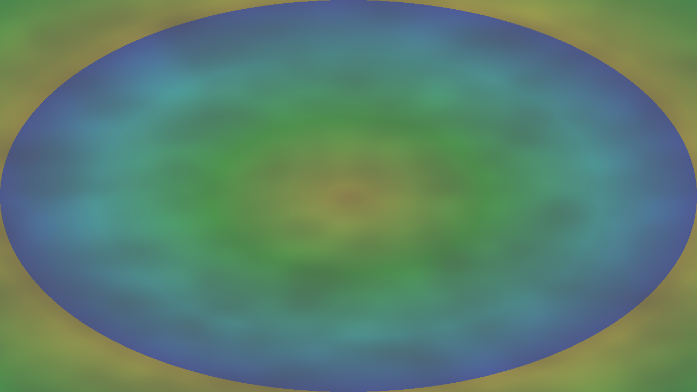
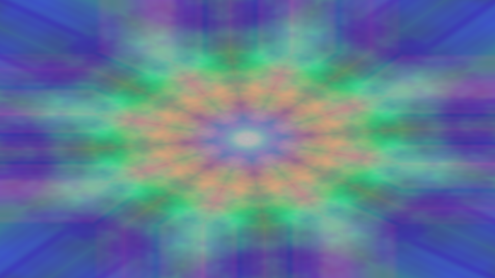
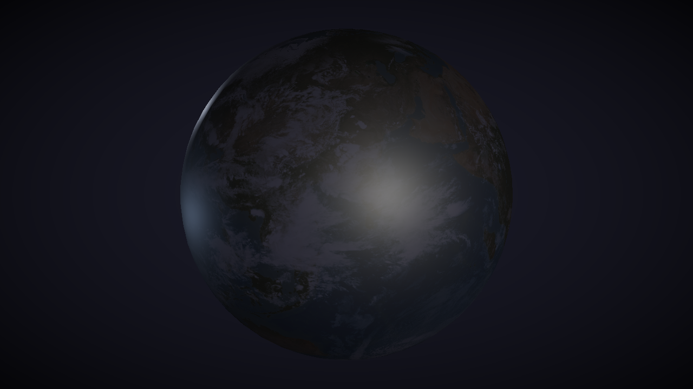
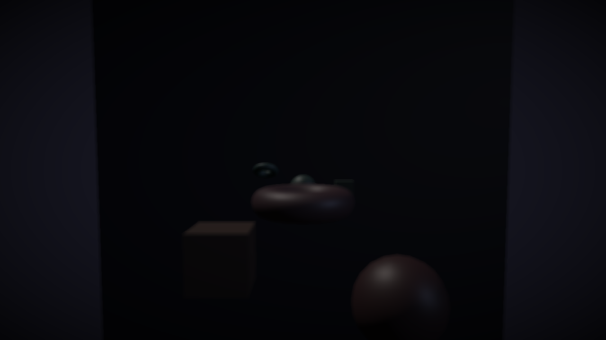
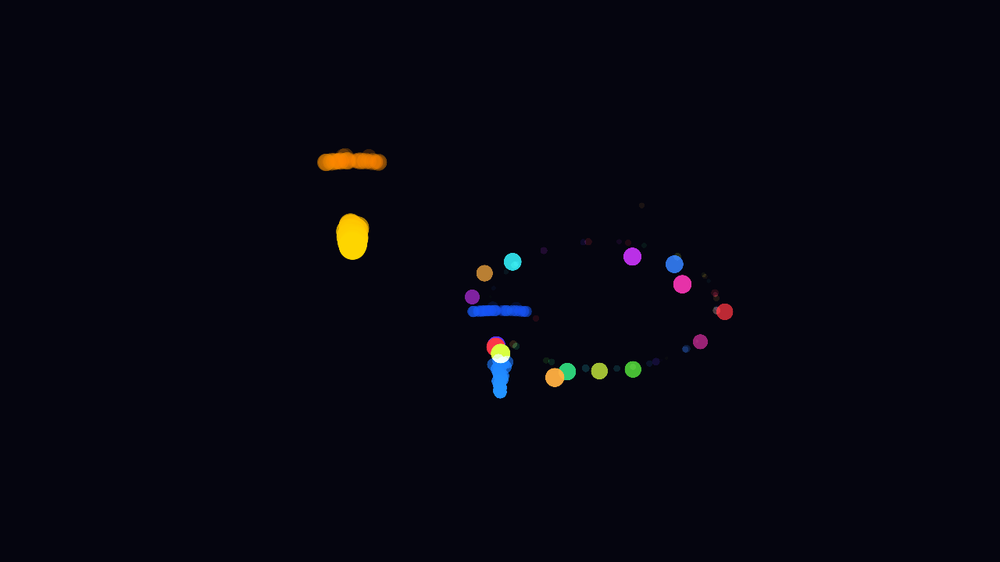
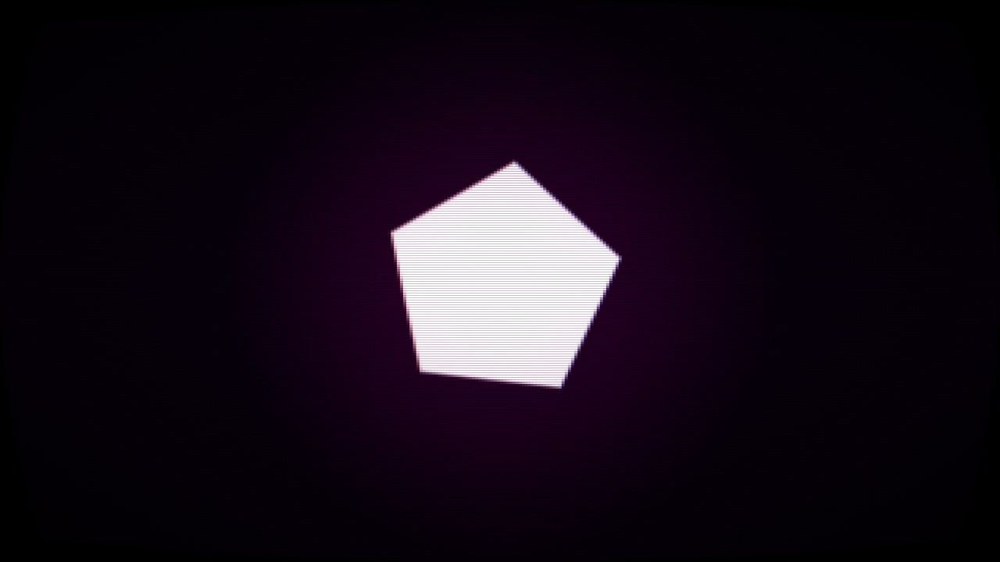
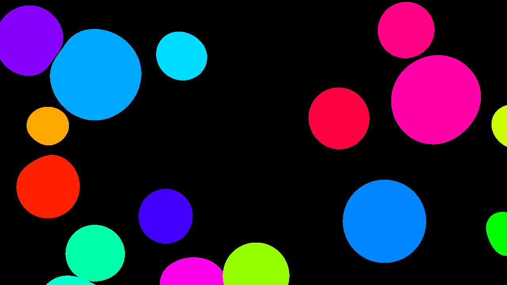
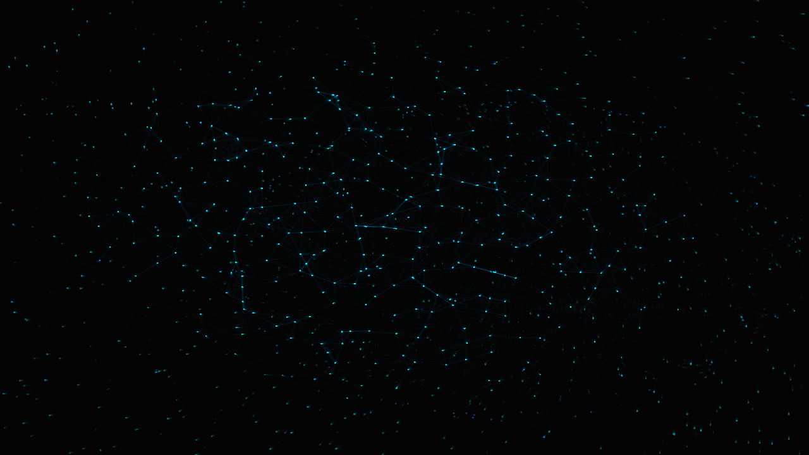

# Vivid

[](https://github.com/seethroughlab/vivid/actions/workflows/ci.yml)
[](https://github.com/seethroughlab/vivid/actions/workflows/docs.yml)
[](LICENSE)

A creative coding framework for real-time audio-visual work with hot-reloadable C++ chains. Clean, consistent API designed for both manual coding and AI-assisted development.

## Features

- **Audio-Visual Parity** - Audio and visuals are equal peers in code. Native synthesis, sequencing, and effects—no external plugins needed
- **Hot Reload** - Edit your C++ code and see changes instantly without restarting
- **WebGPU Backend** - Modern GPU API via wgpu-native (Metal on macOS, Vulkan/DX12 elsewhere)
- **Chain-Based Architecture** - Connect operators to build audio-visual pipelines
- **Addon System** - Modular design with automatic dependency discovery
- **State Preservation** - Feedback loops and animations survive hot reloads
- **LLM-Friendly** - Designed for AI-assisted development (see below)

## Showcase

<p align="center">
  
  
</p>
<p align="center">
  
  
</p>
<p align="center">
  
  
</p>
<p align="center">
  
  
</p>

*From top-left: Feedback spirals, Kaleidoscope mirror effect, 3D PBR globe, Depth of field, GPU particles, Retro CRT simulation, Candy-style animation, Flow field visualization*

## Quick Start

### Requirements

- CMake 3.20+
- C++17 compiler (Clang, GCC, or MSVC)
- macOS, Windows, or Linux

### Build

```bash
git clone https://github.com/seethroughlab/vivid.git
cd vivid
cmake -B build && cmake --build build
```

### Run an Example

```bash
./build/bin/vivid examples/2d-effects/chain-basics
```

Press `F` to toggle fullscreen, `Tab` to view chain visualizer, `Esc` to quit.

## Usage

Create a `chain.cpp` file:

```cpp
#include <vivid/vivid.h>
#include <vivid/effects/effects.h>

using namespace vivid;
using namespace vivid::effects;

void setup(Context& ctx) {
    auto& chain = ctx.chain();

    // Add operators and configure properties
    auto& noise = chain.add<Noise>("noise");
    noise.scale = 4.0f;
    noise.speed = 0.5f;
    noise.octaves = 4;

    auto& hsv = chain.add<HSV>("color");
    hsv.input(&noise);           // Connect via pointer
    hsv.hueShift = 0.6f;
    hsv.saturation = 0.8f;

    chain.output("color");
}

void update(Context& ctx) {
    // Parameter tweaks go here (optional)
}

VIVID_CHAIN(setup, update)
```

Run it:

```bash
./build/bin/vivid path/to/your/project
```

Edit your code while it's running - changes apply automatically.

## How It Works

- **setup()** is called once on load and on each hot-reload
- **update()** is called every frame
- The core automatically calls `chain.init()` after setup and `chain.process()` after update
- Operator state (like Feedback buffers, video playback position) is preserved across hot-reloads

## Available Operators

### Generators
- `Noise` - Fractal noise (Perlin, Simplex, Worley, Value)
- `SolidColor` - Constant color
- `Ramp` - Linear gradient
- `Gradient` - Multi-mode gradients (linear, radial, angular, diamond)
- `Shape` - SDF shapes (circle, rect, triangle, star, polygon)
- `LFO` - Oscillators (sine, triangle, saw, square)
- `Image` - Load images from disk

### Effects
- `Blur` - Gaussian blur
- `Transform` - Scale, rotate, translate
- `HSV` - Hue/saturation/value adjustment
- `Brightness` - Brightness, contrast, gamma
- `Mirror` - Axis mirroring and kaleidoscope
- `Displace` - Texture-based distortion
- `Edge` - Sobel edge detection
- `Pixelate` - Mosaic effect
- `ChromaticAberration` - RGB separation
- `Bloom` - Glow effect
- `Tile` - Texture tiling
- `Feedback` - Frame feedback with decay

### Retro/Post-Processing
- `Dither` - Ordered dithering (Bayer 2x2, 4x4, 8x8)
- `Quantize` - Color palette reduction
- `Scanlines` - CRT-style lines
- `CRTEffect` - Full CRT simulation (curvature, vignette, phosphor)
- `Downsample` - Low-res pixelated look

### Modulation
- `Math` - Mathematical operations (add, multiply, clamp, remap, etc.)
- `Logic` - Comparison and logic (greater than, in range, toggle, etc.)

### Compositing
- `Composite` - Blend multiple inputs
- `Switch` - Select between inputs

### Media (vivid-video addon)
- `VideoPlayer` - Video playback with codec support:
  - HAP (GPU-compressed, best performance)
  - H.264, ProRes, MPEG-2
  - Methods: `.play()`, `.pause()`, `.restart()`, `.seek()`, `.loop()`, `.speed()`
- `Webcam` - Camera capture (macOS: AVFoundation, Windows: Media Foundation)
- `Image` - Static image loading (PNG, JPG, BMP, TGA)

### Particles
- `Particles` - 2D particle system with physics
- `PointSprites` - GPU point rendering

### Audio Synthesis (vivid-audio addon)

**Timing & Sequencing:**
- `Clock` - BPM-based timing with swing and divisions
- `Sequencer` - 16-step pattern sequencer with trigger callbacks
- `Euclidean` - Euclidean rhythm generator

**Drums:**
- `Kick` - 808-style kick with pitch envelope
- `Snare` - Snare with tone/noise mix
- `HiHat` - Hi-hat with open/closed modes
- `Clap` - Handclap with multiple bursts

**Synthesis:**
- `Oscillator` - Waveforms (sine, saw, square, triangle)
- `PolySynth` - Polyphonic synthesizer with voice management
- `Envelope` - ADSR envelope generator

**Effects:**
- `Delay` - Delay with feedback
- `Reverb` - Room reverb
- `Chorus`, `Flanger`, `Phaser` - Modulation effects
- `Compressor`, `Limiter` - Dynamics
- `TapeEffect` - Wow, flutter, saturation (vintage character)

**Lo-fi:**
- `Bitcrush` - Bit/sample rate reduction
- `Overdrive` - Soft saturation
- `Crackle` - Vinyl crackle

**Analysis:**
- `FFT` - Spectrum analysis
- `BandSplit` - Frequency band levels (bass/mid/high)
- `BeatDetect` - Beat/transient detection
- `Levels` - RMS and peak metering

**I/O:**
- `AudioIn` - Microphone/line input
- `AudioFile` - Audio file playback
- `MidiIn` - MIDI note/CC input

### 3D Rendering (vivid-render3d addon)

**Primitives:**
- `Box` - `.size(w, h, d)`, `.flatShading()`
- `Sphere` - `.radius()`, `.segments()`, `.computeTangents()`
- `Cylinder` - `.radius()`, `.height()`, `.segments()`, `.flatShading()`
- `Cone` - `.radius()`, `.height()`, `.segments()`
- `Torus` - `.outerRadius()`, `.innerRadius()`, `.segments()`, `.rings()`
- `Plane` - `.size(w, h)`, `.subdivisions()`

**CSG Boolean Operations:**
- `Boolean` - `.inputA()`, `.inputB()`, `.operation(BooleanOp::Union/Subtract/Intersect)`

**Scene Composition:**
- `SceneComposer` - Compose multiple meshes with transforms and colors
- `Render3D` - Render scenes with multiple shading modes

**Shading Modes:**
- `ShadingMode::PBR` - Physically-based rendering (Cook-Torrance BRDF)
- `ShadingMode::Flat` - Per-fragment flat shading
- `ShadingMode::Gouraud` - Per-vertex shading (PS1-style)
- `ShadingMode::Unlit` - No lighting, pure color/texture

**Lighting (supports up to 4 lights):**
- `DirectionalLight` - Sun-like parallel rays with direction, color, intensity
- `PointLight` - Omnidirectional light with position, color, intensity, range
- `SpotLight` - Cone-shaped light with position, direction, angle, falloff
- `CameraOperator` - Perspective camera with orbit controls

**GPU Instancing:**
- `InstancedRender3D` - Render thousands of identical meshes in a single draw call
  - Per-instance transforms, colors, and material properties
  - Use cases: asteroid fields, forests, crowds, particle debris

**PBR Materials:**
- `TexturedMaterial` - Full PBR material with texture maps:
  - `.baseColor()`, `.normal()`, `.metallic()`, `.roughness()`, `.ao()`, `.emissive()`
- `IBLEnvironment` - Image-based lighting from HDR environment maps

## Example: Video with Effects

```cpp
#include <vivid/vivid.h>
#include <vivid/effects/effects.h>
#include <vivid/video/video.h>

using namespace vivid;
using namespace vivid::effects;
using namespace vivid::video;

void setup(Context& ctx) {
    auto& chain = ctx.chain();

    auto& video = chain.add<VideoPlayer>("video");
    video.file = "assets/videos/my-video.mov";
    video.loop(true);

    auto& hsv = chain.add<HSV>("color");
    hsv.input(&video);
    hsv.saturation = 1.2f;

    chain.output("color");
}

void update(Context& ctx) {
    auto& video = ctx.chain().get<VideoPlayer>("video");

    // Space to pause/play
    if (ctx.key(GLFW_KEY_SPACE).pressed) {
        video.isPlaying() ? video.pause() : video.play();
    }
}

VIVID_CHAIN(setup, update)
```

## Example: 3D Scene with PBR

```cpp
#include <vivid/vivid.h>
#include <vivid/render3d/render3d.h>

using namespace vivid;
using namespace vivid::render3d;

void setup(Context& ctx) {
    auto& chain = ctx.chain();

    // Create geometry
    auto& box = chain.add<Box>("box");
    box.size(1.0f, 1.0f, 1.0f);

    auto& sphere = chain.add<Sphere>("sphere");
    sphere.radius(0.6f);
    sphere.segments(32);

    // CSG: subtract sphere from box
    auto& csg = chain.add<Boolean>("csg");
    csg.inputA(&box);
    csg.inputB(&sphere);
    csg.operation(BooleanOp::Subtract);

    // Scene composition
    auto& scene = SceneComposer::create(chain, "scene");
    scene.add(&csg, glm::mat4(1.0f), glm::vec4(0.9f, 0.3f, 0.3f, 1.0f));

    // Camera and lighting
    auto& camera = chain.add<CameraOperator>("camera");
    camera.orbitCenter(0, 0, 0);
    camera.distance(5.0f);
    camera.fov(50.0f);

    auto& sun = chain.add<DirectionalLight>("sun");
    sun.direction(1, 2, 1);
    sun.intensity = 1.5f;

    // Render
    auto& render = chain.add<Render3D>("render");
    render.setInput(&scene);
    render.setCameraInput(&camera);
    render.setLightInput(&sun);
    render.setShadingMode(ShadingMode::PBR);
    render.metallic = 0.1f;
    render.roughness = 0.5f;

    chain.output("render");
}

void update(Context& ctx) {
    // Animate camera orbit
    auto& camera = ctx.chain().get<CameraOperator>("camera");
    camera.azimuth(static_cast<float>(ctx.time()) * 0.3f);
}

VIVID_CHAIN(setup, update)
```

## Example: Audio-Reactive Visuals

```cpp
#include <vivid/vivid.h>
#include <vivid/effects/effects.h>
#include <vivid/audio/audio.h>
#include <vivid/audio_output.h>

using namespace vivid;
using namespace vivid::effects;
using namespace vivid::audio;

void setup(Context& ctx) {
    auto& chain = ctx.chain();

    // Audio: drum machine
    auto& clock = chain.add<Clock>("clock");
    clock.bpm = 120.0f;

    auto& kickSeq = chain.add<Sequencer>("kickSeq");
    kickSeq.steps = 16;
    kickSeq.setPattern(0b0001000100010001);

    auto& kick = chain.add<Kick>("kick");
    auto& bands = chain.add<BandSplit>("bands");
    bands.input("kick");

    auto& audioOut = chain.add<AudioOutput>("audioOut");
    audioOut.setInput("kick");
    chain.audioOutput("audioOut");

    // Visuals: bass-reactive particles
    auto& noise = chain.add<Noise>("noise");
    noise.scale = 4.0f;

    auto& flash = chain.add<Flash>("flash");
    flash.input(&noise);
    flash.decay = 0.9f;
    flash.color.set(1.0f, 0.5f, 0.2f);

    chain.output("flash");

    // Connect audio triggers to visuals
    auto* chainPtr = &chain;
    kickSeq.onTrigger([chainPtr](float velocity) {
        chainPtr->get<Kick>("kick").trigger();
        chainPtr->get<Flash>("flash").trigger(velocity);
    });
}

void update(Context& ctx) {
    auto& chain = ctx.chain();
    auto& clock = chain.get<Clock>("clock");

    if (clock.triggered()) {
        chain.get<Sequencer>("kickSeq").advance();
    }

    // Modulate visuals from audio analysis
    float bass = chain.get<BandSplit>("bands").bass();
    chain.get<Noise>("noise").scale = 4.0f + bass * 10.0f;

    chain.process(ctx);
}

VIVID_CHAIN(setup, update)
```

## UI & Visualization

Vivid includes a built-in chain visualizer powered by ImGui and ImNodes.

### Controls
- `Tab` - Toggle the visualizer overlay
- `F` - Toggle fullscreen
- `V` - Toggle vsync (in examples that support it)
- `Ctrl+Drag` - Pan the chain visualizer
- `Esc` - Quit

### Chain Visualizer Features
- **Node Graph** - See your operator chain as connected nodes
- **Live Thumbnails** - Each node shows its real-time output texture
- **Parameter Display** - View current parameter values on each node
- **Connection Visualization** - See how operators are wired together
- **Performance Overlay** - FPS, frame time, and resolution display

## Project Structure

```
vivid/
├── core/                     # Runtime engine with integrated UI
│   ├── src/                  # Main runtime, hot-reload, addon discovery
│   ├── include/vivid/        # Public API headers
│   ├── imgui/                # Chain visualizer (ImGui/ImNodes)
│   └── shaders/              # Blit and text shaders
├── addons/                   # Optional feature packages
│   ├── vivid-io/             # Image loading utilities (shared by other addons)
│   ├── vivid-effects-2d/     # 2D texture operators (always linked)
│   ├── vivid-video/          # Video playback (HAP, H.264, etc.)
│   └── vivid-render3d/       # 3D rendering (PBR, CSG, IBL)
├── examples/                 # Curated user examples (by category)
├── testing-fixtures/         # Test examples for CI/regression
└── assets/                   # Shared resources
```

## Examples

Examples are organized by category. See `examples/README.md` for the full learning path.

| Category | Example | Description |
|----------|---------|-------------|
| Getting Started | `01-template` | Heavily commented starter |
| Getting Started | `02-hello-noise` | Minimal noise generator |
| 2D Effects | `chain-basics` | Multi-operator chain with image distortion |
| 2D Effects | `feedback` | Recursive feedback effects |
| 2D Effects | `particles` | 2D particle system with physics |
| 2D Effects | `retro-crt` | Full retro post-processing pipeline |
| Audio | `drum-machine` | Drum synthesis and sequencing |
| Audio | `audio-reactive` | Audio analysis driving visuals |
| 3D Rendering | `3d-basics` | Primitives, camera, CSG, lighting |
| 3D Rendering | `gltf-loader` | GLTF/GLB model loading |
| 3D Rendering | `instancing` | GPU instanced rendering |

Run any example:
```bash
./build/bin/vivid examples/getting-started/01-template
```

## Addon System

Addons are automatically discovered by scanning your chain.cpp `#include` directives:

```cpp
#include <vivid/effects/noise.h>   // → vivid-effects-2d addon
#include <vivid/video/player.h>    // → vivid-video addon
```

Each addon has an `addon.json` with metadata:
```json
{
  "name": "vivid-video",
  "version": "0.1.0",
  "operators": ["VideoPlayer", "AudioPlayer"]
}
```

The hot-reload system automatically adds include paths and links libraries for discovered addons.

## LLM-Friendly Design

Vivid is designed with AI-assisted development in mind:

- **Minimal Core** - ~600 lines of runtime code that fits in context windows
- **Self-Contained Operators** - Each operator is a single .h/.cpp pair with embedded shaders
- **Consistent Patterns** - All operators follow the same structure (init/process/cleanup)
- **Comprehensive Documentation** - LLM-optimized reference docs and recipes
- **Hot Reload** - Instant feedback loop when iterating with AI assistance
- **Automatic State Management** - No boilerplate for chain lifecycle

### Documentation for LLMs

| File | Purpose |
|------|---------|
| [docs/LLM-REFERENCE.md](docs/LLM-REFERENCE.md) | Compact operator reference (~200 lines) |
| [docs/RECIPES.md](docs/RECIPES.md) | Complete chain.cpp examples for common effects |
| [ROADMAP.md](ROADMAP.md) | Full architecture and development history |

### Using AI Assistants with Your Project

Create a `CLAUDE.md` file in your project folder to give AI assistants context about your specific project:

```markdown
# My Vivid Project

## Goal
[What effect you're trying to create]

## Current Chain
[Brief description of your operator chain]

## Resources
- docs/LLM-REFERENCE.md - Operator reference
- docs/RECIPES.md - Effect examples
```

See `examples/getting-started/01-template/` for a complete starter project with CLAUDE.md.

## License

MIT

## Contributing

Contributions welcome! Please read the [ROADMAP.md](ROADMAP.md) for current development priorities.
