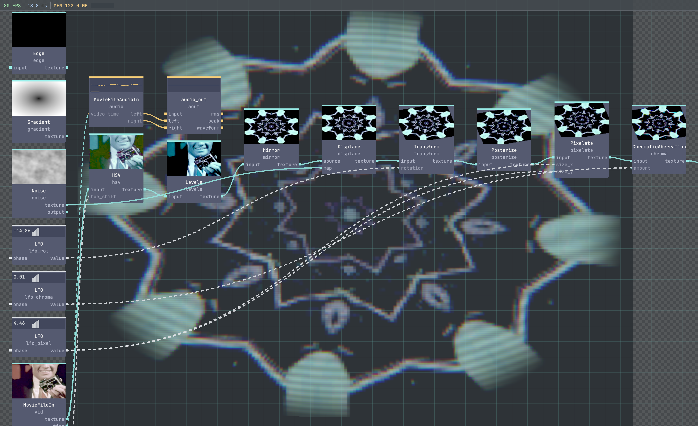
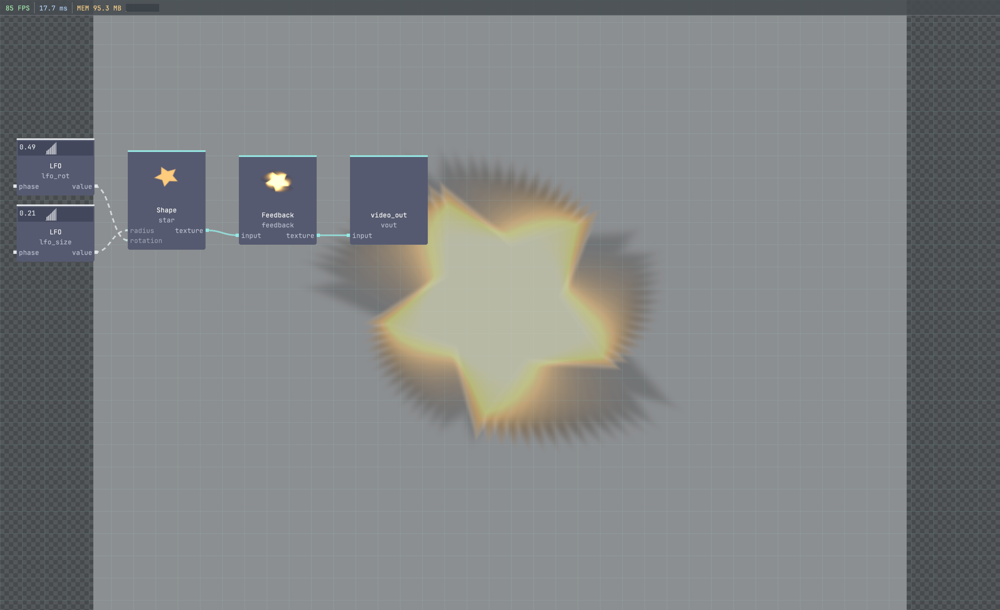
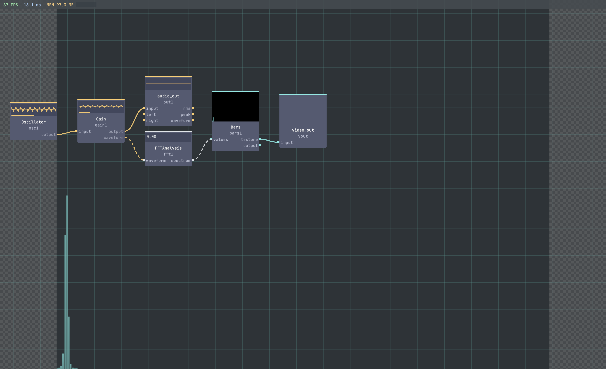

# VIVID

**A real-time creative coding platform where audio and visuals are equal peers in the same graph.**

Vivid is a node-based environment for building audiovisual performances, installations, and interactive art. Audio operators (synthesizers, drum machines, effects) and GPU operators (shapes, filters, compositing) share the same graph, driven by the same data, with the same level of expressive control. Everything is a JSON file. Everything hot-reloads.

Built in C++ with WebGPU (Dawn). Designed from the ground up for LLM-assisted creative exploration.



## Screenshots

| | |
|---|---|
|  |  |
| **Instanced shapes driven by audio envelopes** — A chord progression triggers a wavetable synth and drum kit; per-voice ADSR envelopes drive GPU shape instancing. | **Feedback with temporal accumulation** — A star shape modulated by LFOs feeds into a feedback operator with decay, zoom, and rotation, creating recursive visual trails. |
|  |  |
| **Audio-reactive FFT visualization** — An oscillator's output is analyzed in real time; the frequency spectrum drives an instanced bar graph on the GPU. | **Video filter chain** — A movie file piped through HSV, mirror, displace, posterize, chromatic aberration, scanlines, CRT effect, and more — all modulated by LFOs. |

## Features

- **Audio-visual parity** — Audio and GPU operators live in the same graph, connected by the same wires
- **Three execution domains** — GPU (textures), Audio (sample-rate buffers), and Control (per-frame values) evaluated in dependency order
- **Core operator set + package ecosystem** — Core operators ship in vivid; specialized families (3D, glitch, CEF) live in sibling package repos
- **Spreads** — Implicit vectorization: a single wire carries N values, enabling polyphony and instancing without manual fan-out
- **25 data-driven WGSL filters** — Self-describing GPU shaders loaded at runtime from `.wgsl` files with embedded metadata
- **Hot-reload everything** — Edit a graph JSON, a WGSL filter, or recompile an operator dylib — changes apply instantly without restart
- **JSON graph as single source of truth** — Every graph is a plain JSON file: nodes, connections, parameters, layout
- **Live thumbnails on every node** — GPU nodes show texture previews; audio nodes show waveforms; control nodes show value readouts
- **MCP server** — Comprehensive Model Context Protocol surface for graph editing, package workflows, introspection, diagnostics, and checks
- **MIDI input with CC learn** — Hardware controller support with automatic CC mapping

## Core Operators (Built-In)

### GPU
Shape, Noise, Composite, Bloom, Feedback, Metaball, Texture Loader, Time Machine, Text, Rich Text, SVG Render, Texture Analysis, Particles, Instanced Shapes, Trails, Flocking, Fluid, Reaction Diffusion, Cellular Automata, Mesh Warp, LUT Apply, Scopes, Movie File In, Movie Video Out, Webcam In, Syphon In, Syphon Out

### GPU Filters (WGSL)
HSV, Levels, Blur, Edge, Mirror, Pixelate, Posterize, Gradient, Chromatic Aberration, Scanlines, CRT Effect, Transform, Displace, Dither, Halftone, Tile, Ramp, Solid Color, Switch, Division Raster, Hex Grid, Radial Rainbow, Raster Grid, Spirograph, Voronoi

### Audio
**Synthesis:** Oscillator, FM Synth, Gain, Noise
**Drums:** Drum Kick, Drum Snare, Drum HiHat, Drum Clap, Drum Cymbal, Drum Tom
**Samplers:** SP404, Sampler, Slicer, Granular Synth, Vocoder, Spectral Freeze
**Effects:** Reverb, Delay, Bitcrush, Distortion, Filter, Mixer, Compressor, Limiter, Chorus, Phaser, Flanger, Stereo Pan Width, Ping Pong Delay, Ring Mod, Parametric EQ
**Spread:** Spread ADSR, Spread LFO
**I/O:** Mic Input, MIDI File Player, Movie Audio Out

### Control
**Fundamentals:** Clock, LFO, Math, Envelope, MIDI Input, FFT Analysis, Logic, Gate, Random, Smooth, Stack, Alternate, Modulated Gain, Spread Noise, Mouse, Keyboard, Basename, Folder List, OSC In, OSC Out, Step Counter, String Select, Sample Hold, Quantizer, Macro, Random S&H, MSEG, Step Seq, Path Animate
**Sequencers:** Sequencer, Drum Sequencer, Pattern Seq, Note Pattern, Note Duration, Arpeggiator, Chord Progression, State Machine, Tracker, Euclidean, Pat Transform, Phase To MIDI

## Package Operators

Install additional package libraries:

- `vivid-3d`: 3D rendering operator suite
- `vivid-wavetable`: wavetable synthesizer
- `vivid-glitch`: creative audio/GPU glitch effects
- `vivid-cef`: Chromium Embedded Framework browser source
- `vivid-physics2d`: 2D physics simulation
- `vivid-plexus`: plexus GPU + audio effects

See [docs/PACKAGE-LIBRARIES.md](docs/PACKAGE-LIBRARIES.md) for install/link/rebuild commands and package details.

### Sinks
`audio_out` (stereo output), `video_out` (GPU display with fit/fill/stretch)

## Getting Started

Canonical onboarding guide:
- **[First 10 Minutes](docs/GETTING-STARTED.md)**
- **[Graph Browser Index](graphs/README.md)**

### Release Build (Recommended)

Download the latest macOS release build:
- <https://github.com/seethroughlab/vivid/releases>

Open `Vivid.app`, then use **File -> Open Example...** and load `av_demo`.

### Build From Source (Developers)

```bash
git clone --recursive https://github.com/seethroughlab/vivid.git
cd vivid
cmake -B build
cmake --build build
./build/vivid graphs/intro/av_demo.json

# Headless screenshot
./build/vivid graphs/filters/wgsl_filters_demo.json --screenshot output.png --screenshot-delay 15
```

### Requirements

Vivid itself launches without additional tools, but **installing, linking, or building operator packages** requires a working C++ toolchain (cmake, git, and a C++ compiler). After installing, run `vivid doctor` to confirm your setup, or use **Help → Check System Requirements...** inside the app.

**macOS** (primary supported platform):
- Xcode Command Line Tools: `xcode-select --install`
- Homebrew (recommended): [brew.sh](https://brew.sh)
- `brew install cmake git`

**Linux (Debian/Ubuntu):**
- `sudo apt install build-essential cmake git`

**Linux (Fedora/RHEL):**
- `sudo dnf install gcc-c++ make cmake git`

**Windows:**
- Visual Studio 2022 with the "Desktop development with C++" workload (provides the MSVC compiler)
- [Git for Windows](https://git-scm.com/download/win)
- [CMake](https://cmake.org/download/)

Developer/source builds additionally need CMake 3.20+ and a C++17-capable compiler. macOS is the only first-class release target; Linux/Windows builds from source may work but aren't officially supported yet.

You can point Vivid at non-standard tool paths via the `VIVID_CXX`, `VIVID_CMAKE`, and `VIVID_GIT` environment variables.

Dependencies are vendored or fetched automatically: WebGPU (Dawn), GLFW, miniaudio, RtMidi, nlohmann/json, stb_image_write, stb_truetype, IXWebSocket, CLI11, oscpack, hap.

## Architecture

Vivid evaluates a directed acyclic graph across three domains every frame:

| Domain | Rate | Data type | Examples |
|--------|------|-----------|---------|
| **Control** | Per-frame (~60 Hz) | Scalar values, spreads | Clock, LFO, Envelope, MIDI, Mouse |
| **GPU** | Per-frame | Textures (1280x720) | Shape, Filters, Composite |
| **Audio** | Per-sample (48 kHz) | Float buffers (256 frames) | Oscillator, Drums, Effects |

Control outputs can drive both GPU and Audio parameters. GPU and Audio operators expose analysis outputs (peak, RMS, spectrum) back to the control domain. Spreads propagate automatically — connect a 16-voice chord to a synth and you get 16-voice polyphony; connect those envelopes to a shape and you get 16 instances.

## Documentation

- **[Getting Started](docs/GETTING-STARTED.md)** — First 10 minutes, starter graph set, and graph browse index
- **[Product Requirements](docs/PRD.md)** — Vision, core principles, system architecture
- **[Architecture](docs/ARCHITECTURE.md)** — Language choice, build system, operator contract, directory structure
- **[Interface Design](docs/INTERFACE.md)** — UI architecture, visual style, node graph rendering
- **[LLM Integration](docs/LLM-INTEGRATION.md)** — MCP server, the four LLM roles
- **[Package Libraries](docs/PACKAGE-LIBRARIES.md)** — Install/link/rebuild package operator libraries
- **[Package Template](https://github.com/seethroughlab/vivid-package-template)** — Scaffold and author new package repos

## Status

Active development. Core engine, node graph UI, core operators + package ecosystem, WGSL filter framework, and MCP server are in active use.

## License

Vivid is source-available under the [Vivid Source Available License](LICENSE). You can use it freely for personal projects, artistic work, and education. Operator Packages you create in separate repositories are yours to license however you choose. See [LICENSING.md](LICENSING.md) for full details.

Contributions to this repository are subject to the [Contributor License Agreement](CLA.md).

---

*Jeff Crouse / [See-Through Lab](https://seethroughlab.com)*
