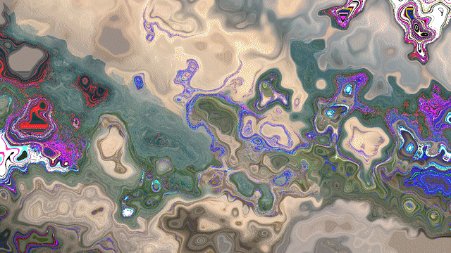
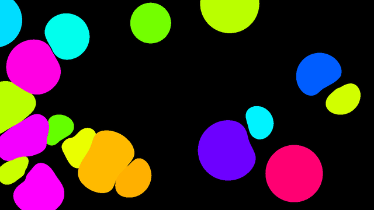
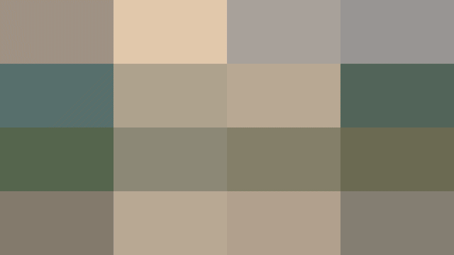
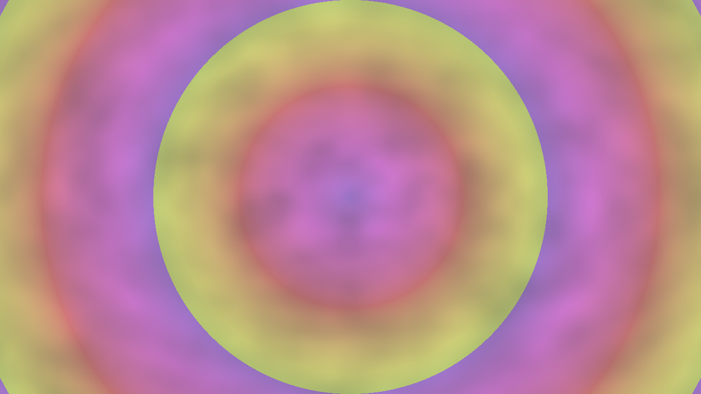
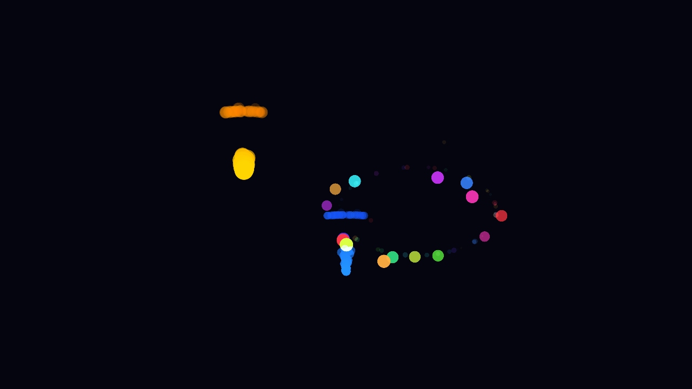
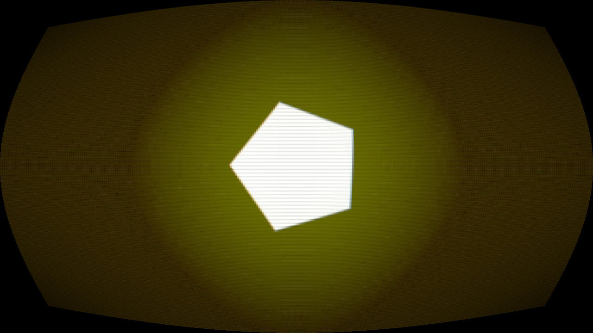
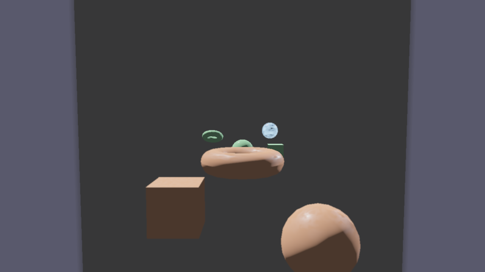

# Vivid

[](https://github.com/seethroughlab/vivid/actions/workflows/ci.yml)
[](https://github.com/seethroughlab/vivid/actions/workflows/docs.yml)
[](LICENSE)

A creative coding framework for real-time audio-visual work. Hot-reloadable C++ chains, WebGPU rendering, and optional AI-assisted development via built-in MCP.

## Features

- **Audio-Visual Parity** - Audio and visuals are equal peers in code. Native synthesis, sequencing, and effects—no external plugins needed
- **Hot Reload** - Edit your C++ code and see changes instantly without restarting
- **IDE & AI Integration** - [VS Code extension](https://github.com/seethroughlab/vivid-vscode) for autocomplete and diagnostics, plus MCP server for AI-assisted development
- **WebGPU Backend** - Modern GPU API via wgpu-native (Metal on macOS, Vulkan/DX12 elsewhere)
- **Chain-Based Architecture** - Connect operators to build audio-visual pipelines
- **Addon System** - Modular design with automatic dependency discovery
- **State Preservation** - Feedback loops and animations survive hot reloads

## Showcase

<p align="center">
  
  
</p>
<p align="center">
  
  
</p>
<p align="center">
  
  
</p>
<p align="center">
  
  
</p>

*Chain basics (90 lines), 3D globe (306 lines), Candy physics (241 lines), Division raster (144 lines), Feedback spirals (78 lines), Particles (97 lines), Retro CRT (104 lines), Depth of field (376 lines)*

## Quick Start

### Requirements

- CMake 3.20+
- C++17 compiler (Clang, GCC, or MSVC)
- macOS, Windows, or Linux

### Build

```bash
git clone https://github.com/seethroughlab/vivid.git
cd vivid
cmake -B build && cmake --build build
```

### Run a Project

```bash
./build/bin/vivid projects/2d-effects/chain-basics
```

Press `F` to toggle fullscreen, `Tab` to view chain visualizer, `Esc` to quit.

## Development Workflow

### VS Code Extension (Recommended)

Install the [Vivid VS Code extension](https://github.com/seethroughlab/vivid-vscode) for:
- Syntax highlighting for chain.cpp
- Autocomplete for operators and parameters
- Live error diagnostics
- Parameter documentation on hover

### Claude Code Integration

For AI-assisted development, add Vivid's MCP server to your Claude Code config:

```json
// ~/.claude.json
{
  "mcpServers": {
    "vivid": {
      "command": "/path/to/build/bin/vivid",
      "args": ["mcp"]
    }
  }
}
```

This enables Claude to:
- See live parameter values from your running project
- Apply slider adjustments directly to your code
- Query available operators and documentation
- Create, run, and test projects

**Workflow:** Edit code manually OR adjust sliders in the visualizer and let Claude sync the changes back to your chain.cpp.

## Usage

Create a `chain.cpp` file:

```cpp
#include <vivid/vivid.h>
#include <vivid/effects/effects.h>

using namespace vivid;
using namespace vivid::effects;

void setup(Context& ctx) {
    auto& chain = ctx.chain();

    // Add operators and configure properties
    auto& noise = chain.add<Noise>("noise");
    noise.scale = 4.0f;
    noise.speed = 0.5f;
    noise.octaves = 4;

    auto& hsv = chain.add<HSV>("color");
    hsv.input(&noise);           // Connect via pointer
    hsv.hueShift = 0.6f;
    hsv.saturation = 0.8f;

    chain.output("color");
}

void update(Context& ctx) {
    // Parameter tweaks go here (optional)
}

VIVID_CHAIN(setup, update)
```

Run it:

```bash
./build/bin/vivid path/to/your/project
```

Edit your code while it's running - changes apply automatically.

## How It Works

- **setup()** is called once on load and on each hot-reload
- **update()** is called every frame
- The core automatically calls `chain.init()` after setup and `chain.process()` after update
- Operator state (like Feedback buffers, video playback position) is preserved across hot-reloads

## Available Operators

### 2D Effects (Core)
`Noise`, `Gradient`, `Shape`, `Image` — Generators
`Blur`, `Transform`, `HSV`, `Feedback`, `Bloom`, `Displace` — Effects
`Dither`, `Scanlines`, `CRTEffect` — Retro
`Composite`, `Math`, `Particles` — Utility

### Audio (vivid-audio addon)
`Clock`, `Sequencer` — Timing
`Kick`, `Snare`, `HiHat`, `Oscillator`, `PolySynth` — Synthesis
`Delay`, `Reverb`, `Bitcrush`, `TapeEffect` — Effects
`FFT`, `BandSplit`, `BeatDetect` — Analysis

### 3D Rendering (vivid-render3d addon)
`Box`, `Sphere`, `Cylinder`, `Torus`, `Plane` — Primitives
`Boolean` — CSG operations
`Render3D`, `SceneComposer` — Rendering (PBR, Flat, Gouraud, Unlit)
`DirectionalLight`, `PointLight`, `SpotLight` — Lighting

### Media (vivid-video addon)
`VideoPlayer` — HAP, H.264, ProRes playback
`Webcam` — Camera capture

See examples in `src/vivid-core/examples/` and `modules/*/examples/` for operator usage patterns.

## Example: Video with Effects

```cpp
#include <vivid/vivid.h>
#include <vivid/effects/effects.h>
#include <vivid/video/video.h>

using namespace vivid;
using namespace vivid::effects;
using namespace vivid::video;

void setup(Context& ctx) {
    auto& chain = ctx.chain();

    auto& video = chain.add<VideoPlayer>("video");
    video.file = "assets/videos/my-video.mov";
    video.loop(true);

    auto& hsv = chain.add<HSV>("color");
    hsv.input(&video);
    hsv.saturation = 1.2f;

    chain.output("color");
}

void update(Context& ctx) {
    auto& video = ctx.chain().get<VideoPlayer>("video");

    // Space to pause/play
    if (ctx.key(GLFW_KEY_SPACE).pressed) {
        video.isPlaying() ? video.pause() : video.play();
    }
}

VIVID_CHAIN(setup, update)
```

## Example: 3D Scene with PBR

```cpp
#include <vivid/vivid.h>
#include <vivid/render3d/render3d.h>

using namespace vivid;
using namespace vivid::render3d;

void setup(Context& ctx) {
    auto& chain = ctx.chain();

    // Create geometry
    auto& box = chain.add<Box>("box");
    box.size(1.0f, 1.0f, 1.0f);

    auto& sphere = chain.add<Sphere>("sphere");
    sphere.radius(0.6f);
    sphere.segments(32);

    // CSG: subtract sphere from box
    auto& csg = chain.add<Boolean>("csg");
    csg.inputA(&box);
    csg.inputB(&sphere);
    csg.operation(BooleanOp::Subtract);

    // Scene composition
    auto& scene = SceneComposer::create(chain, "scene");
    scene.add(&csg, glm::mat4(1.0f), glm::vec4(0.9f, 0.3f, 0.3f, 1.0f));

    // Camera and lighting
    auto& camera = chain.add<CameraOperator>("camera");
    camera.orbitCenter(0, 0, 0);
    camera.distance(5.0f);
    camera.fov(50.0f);

    auto& sun = chain.add<DirectionalLight>("sun");
    sun.direction(1, 2, 1);
    sun.intensity = 1.5f;

    // Render
    auto& render = chain.add<Render3D>("render");
    render.setInput(&scene);
    render.setCameraInput(&camera);
    render.setLightInput(&sun);
    render.setShadingMode(ShadingMode::PBR);
    render.metallic = 0.1f;
    render.roughness = 0.5f;

    chain.output("render");
}

void update(Context& ctx) {
    // Animate camera orbit
    auto& camera = ctx.chain().get<CameraOperator>("camera");
    camera.azimuth(static_cast<float>(ctx.time()) * 0.3f);
}

VIVID_CHAIN(setup, update)
```

## Example: Audio-Reactive Visuals

```cpp
#include <vivid/vivid.h>
#include <vivid/effects/effects.h>
#include <vivid/audio/audio.h>
#include <vivid/audio_output.h>

using namespace vivid;
using namespace vivid::effects;
using namespace vivid::audio;

void setup(Context& ctx) {
    auto& chain = ctx.chain();

    // Audio: drum machine
    auto& clock = chain.add<Clock>("clock");
    clock.bpm = 120.0f;

    auto& kickSeq = chain.add<Sequencer>("kickSeq");
    kickSeq.steps = 16;
    kickSeq.setPattern(0b0001000100010001);

    auto& kick = chain.add<Kick>("kick");
    auto& bands = chain.add<BandSplit>("bands");
    bands.input("kick");

    auto& audioOut = chain.add<AudioOutput>("audioOut");
    audioOut.setInput("kick");
    chain.audioOutput("audioOut");

    // Visuals: bass-reactive particles
    auto& noise = chain.add<Noise>("noise");
    noise.scale = 4.0f;

    auto& flash = chain.add<Flash>("flash");
    flash.input(&noise);
    flash.decay = 0.9f;
    flash.color.set(1.0f, 0.5f, 0.2f);

    chain.output("flash");

    // Connect audio triggers to visuals
    auto* chainPtr = &chain;
    kickSeq.onTrigger([chainPtr](float velocity) {
        chainPtr->get<Kick>("kick").trigger();
        chainPtr->get<Flash>("flash").trigger(velocity);
    });
}

void update(Context& ctx) {
    auto& chain = ctx.chain();
    auto& clock = chain.get<Clock>("clock");

    if (clock.triggered()) {
        chain.get<Sequencer>("kickSeq").advance();
    }

    // Modulate visuals from audio analysis
    float bass = chain.get<BandSplit>("bands").bass();
    chain.get<Noise>("noise").scale = 4.0f + bass * 10.0f;

    chain.process(ctx);
}

VIVID_CHAIN(setup, update)
```

## UI & Visualization

Vivid includes a built-in chain visualizer powered by ImGui and ImNodes.

### Controls
- `Tab` - Toggle the visualizer overlay
- `F` - Toggle fullscreen
- `V` - Toggle vsync (in examples that support it)
- `Ctrl+Drag` - Pan the chain visualizer
- `Esc` - Quit

### Chain Visualizer Features
- **Node Graph** - See your operator chain as connected nodes
- **Live Thumbnails** - Each node shows its real-time output texture
- **Parameter Display** - View current parameter values on each node
- **Connection Visualization** - See how operators are wired together
- **Performance Overlay** - FPS, frame time, and resolution display

## Project Structure

```
vivid/
├── src/                      # All source code
│   ├── core/                 # Runtime engine with integrated UI
│   ├── cli/                  # Command-line interface
│   └── addons/               # Optional feature packages
│       ├── vivid-video/      # Video playback (HAP, H.264, etc.)
│       ├── vivid-render3d/   # 3D rendering (PBR, CSG, IBL)
│       ├── vivid-audio/      # Audio synthesis and analysis
│       └── ...               # Network, MIDI, serial, GUI
├── projects/                 # Runnable example projects (each with own assets/)
├── docs/                     # Documentation and images
├── tests/                    # Automated tests, fixtures, and test assets
└── dev/                      # Developer tools and planning docs
```

## Projects

Projects are organized by category. See `projects/README.md` for the full learning path.

| Category | Project | Description |
|----------|---------|-------------|
| Getting Started | `01-template` | Heavily commented starter |
| Getting Started | `02-hello-noise` | Minimal noise generator |
| 2D Effects | `chain-basics` | Multi-operator chain with image distortion |
| 2D Effects | `feedback` | Recursive feedback effects |
| 2D Effects | `particles` | 2D particle system with physics |
| 2D Effects | `retro-crt` | Full retro post-processing pipeline |
| Audio | `drum-machine` | Drum synthesis and sequencing |
| Audio | `audio-reactive` | Audio analysis driving visuals |
| 3D Rendering | `3d-basics` | Primitives, camera, CSG, lighting |
| 3D Rendering | `gltf-loader` | GLTF/GLB model loading |
| 3D Rendering | `instancing` | GPU instanced rendering |

Run any project:
```bash
./build/bin/vivid projects/getting-started/01-template
```

## Addon System

Addons are automatically discovered by scanning your chain.cpp `#include` directives:

```cpp
#include <vivid/effects/noise.h>   // → vivid-effects-2d addon
#include <vivid/video/player.h>    // → vivid-video addon
```

Each addon has an `addon.json` with metadata:
```json
{
  "name": "vivid-video",
  "version": "0.1.0",
  "operators": ["VideoPlayer", "AudioPlayer"]
}
```

The hot-reload system automatically adds include paths and links libraries for discovered addons.

## Documentation

| File | Purpose |
|------|---------|
| [docs/RECIPES.md](docs/RECIPES.md) | Complete chain.cpp examples |
| [docs/CREATING-OPERATORS.md](docs/CREATING-OPERATORS.md) | Custom operators and addons |

**Tip:** Create a `CLAUDE.md` in your project folder to give Claude context about your specific project. See `projects/getting-started/01-template/` for an example.

## License

MIT

## Contributing

Contributions welcome! Please read the [dev/docs/ROADMAP.md](dev/docs/ROADMAP.md) for current development priorities.
