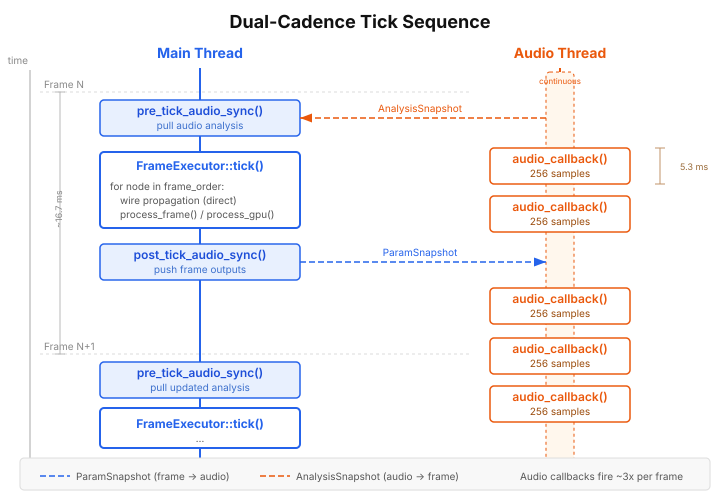
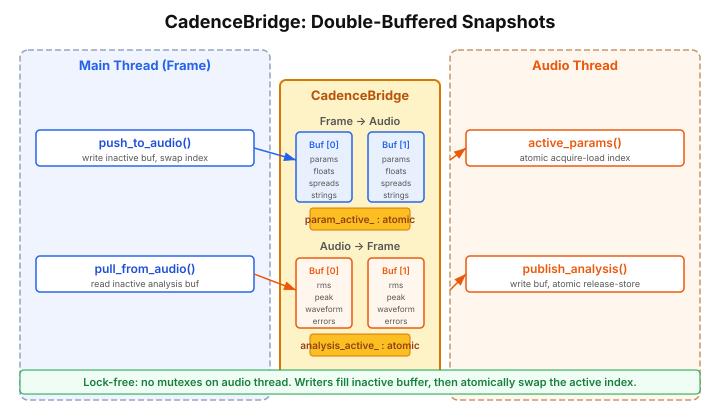
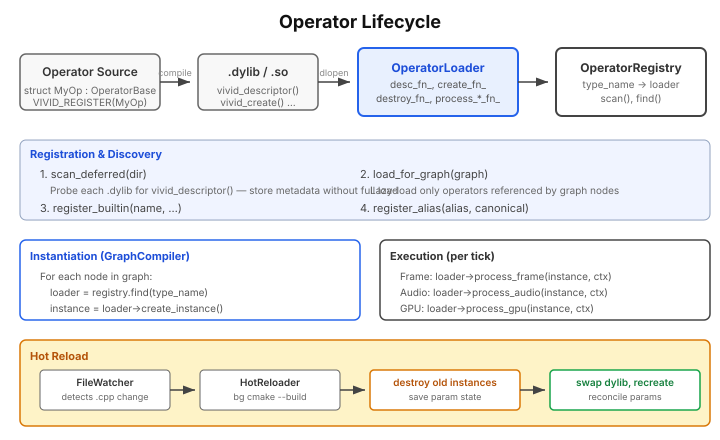
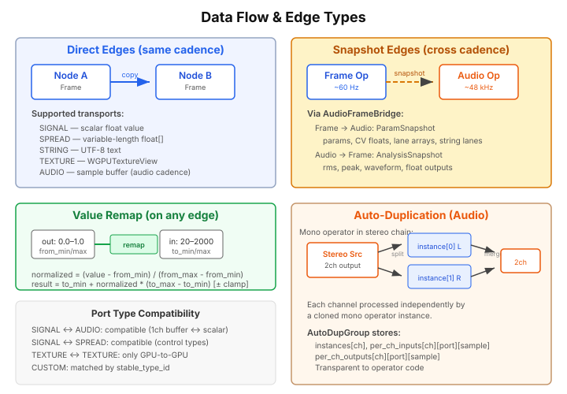

# Vivid Runtime Architecture

*A technical reference for the Vivid audiovisual graph runtime.*

## 1. Introduction

Vivid is a real-time audiovisual graph engine. Users build directed graphs of **operators** — nodes that generate or transform signals, audio, GPU textures, and data — and the runtime evaluates them continuously at two independent rates: a **frame cadence** (~60 Hz, main thread) for control logic and GPU rendering, and an **audio cadence** (48 kHz, dedicated thread) for sample-accurate sound processing.

The runtime's core responsibilities are:

- **Compile** a user-authored graph into an efficient, pre-allocated execution plan.
- **Execute** frame-rate and audio-rate operators in topological order on their respective threads.
- **Synchronize** data between cadences using lock-free double-buffered snapshots.
- **Hot-reload** operator code from recompiled dynamic libraries without stopping playback.


## 2. Architecture Overview

The runtime is composed of several cooperating subsystems:

| Component | Thread | Role |
|-----------|--------|------|
| **RuntimeCore** | Main | Top-level orchestrator. Owns the compiled graph, cadence bridge, and frame executor. Drives the tick cycle. |
| **GraphCompiler** | Main (once) | Static factory that transforms a `Graph` into a `CompiledGraph`. |
| **CompiledGraph** | Both (read-only) | The execution plan: pre-allocated node state, classified edges, and topologically sorted execution orders. |
| **FrameExecutor** | Main | Iterates `frame_order`, propagates direct edges, calls `process_frame()` and `process_gpu()`. |
| **AudioExecutor** | Audio | Iterates `audio_order` inside the miniaudio callback, processes 256-sample buffers at 48 kHz. |
| **CadenceBridge** | Both | Double-buffered snapshot bridge. Transfers parameters frame-to-audio and analysis audio-to-frame without locks. |
| **OperatorRegistry** | Main | Discovers, lazy-loads, and hot-reloads operator dynamic libraries. |
| **GpuContext** | Main | Manages the WebGPU device, queue, and surface. |
| **HotReloader** | Background | Watches source files and runs background cmake builds. |


## 3. The Graph Model

A Vivid graph is a JSON document containing nodes, connections, and metadata.

### NodeDef

Each node declares an operator type and its parameter values:

```json
{
  "osc": {
    "type": "Oscillator",
    "params": { "frequency": 440.0, "amplitude": 0.8, "waveform": 0 }
  }
}
```

Key fields: `type` (operator name), `params` (float values), `string_params` (file paths, text), `cadence_override` (Auto / Frame / Audio), `tex_width` / `tex_height` (per-node GPU resolution).

### ConnectionDef

Connections wire an output port of one node to an input port of another:

```json
{ "from": "osc/output", "to": "gain/input" }
```

Connections may carry an optional **value remap**: `from_min`, `from_max`, `to_min`, `to_max`, and a `clamp` flag. This linearly rescales the value as it crosses the edge.

### Port Types

| Type | ID | Description |
|------|----|-------------|
| `SIGNAL` | 0 | Scalar float (frame) or 1-channel buffer (audio) |
| `AUDIO` | 1 | Multi-channel sample buffer |
| `SPREAD` | 2 | Variable-length float array |
| `STRING` | 3 | UTF-8 text |
| `STRING_SPREAD` | 4 | Variable-length string array |
| `TEXTURE` | 5 | `WGPUTextureView` (GPU only) |

Custom port types can be registered at runtime via the port type registry, identified by a `stable_type_id`.


## 4. Graph Compilation

The `GraphCompiler` transforms a `Graph` plus an `OperatorRegistry` into a `CompiledGraph` — a fully pre-allocated, ready-to-execute representation.


### Compilation Steps

1. **Resolve descriptors.** For each node, look up the `VividOperatorDescriptor` from the registry. This provides port definitions, parameter metadata, execution environment, and cadence capability.

2. **Assign cadences.** Each node is assigned `Cadence::Frame` or `Cadence::Audio`:
   - If the node has `cadence_override == Audio` and the operator is `AUDIO_CAPABLE` → Audio.
   - If `cadence_override == Frame` → Frame.
   - If the descriptor declares `has_process_audio` → Audio.
   - Otherwise → Frame.

3. **Classify edges.** Each connection becomes a `CompiledEdge` with a transport type:
   - **Direct** — both endpoints share the same cadence. The executor copies data during its pass.
   - **Snapshot** — endpoints are on different cadences. Data flows through the `CadenceBridge`.

4. **Topological sort.** Kahn's algorithm produces two independent execution orders:
   - `frame_order` — all Frame and GPU nodes.
   - `audio_order` — all Audio nodes.

5. **Pre-allocate state.** All buffers, parameter arrays, spread storage, string arrays, GPU textures, and audio buffers are allocated up front. No heap allocation occurs during execution.

### CompiledGraph Structure

```
CompiledGraph
├── nodes[]              — CompiledNode instances (all state)
├── edges[]              — CompiledEdge instances
├── frame_order[]        — topological indices for frame nodes
├── audio_order[]        — topological indices for audio nodes
├── frame_direct_edges[] — edge indices within frame cadence
├── audio_direct_edges[] — edge indices within audio cadence
├── frame_to_audio_edges[] — snapshot edge indices
└── audio_to_frame_edges[] — snapshot edge indices
```


## 5. Dual-Cadence Execution

The two cadences run on independent threads at vastly different rates. They never block each other.



### Frame Cadence (~60 Hz, Main Thread)

Each frame follows a three-phase pattern:

1. **pre_tick_audio_sync()** — Pull the latest `AnalysisSnapshot` from the audio thread. Inject RMS, peak, waveform, and scalar outputs into frame-rate nodes.

2. **FrameExecutor::tick()** — Iterate `frame_order`. For each node:
   - Propagate values along `frame_direct_edges` (copy, remap, spread merge).
   - Call `process_frame()` (or `process_gpu()` for GPU nodes).
   - Apply skip logic: only process if time-dependent, dirty, or upstream changed.

3. **post_tick_audio_sync()** — Snapshot frame outputs into the `CadenceBridge` for the audio thread to consume.

### Audio Cadence (~48 kHz = ~188 callbacks/sec, Audio Thread)

The miniaudio callback fires approximately 188 times per second (48000 / 256):

1. Read the active `ParamSnapshot` (lock-free atomic acquire).
2. Iterate `audio_order`. For each node:
   - Propagate audio buffers along `audio_direct_edges`.
   - Handle auto-duplication for mono operators in multi-channel chains.
   - Call `process_audio()` with a `VividAudioContext`.
3. Compute per-node analysis (RMS, peak, waveform ring buffer).
4. Publish the `AnalysisSnapshot` (lock-free atomic release).

### Timing Relationship

At 60 fps and 48 kHz with 256-sample buffers, approximately **3 audio callbacks** execute per visual frame. The two threads are decoupled — if the frame rate drops, audio continues uninterrupted.


## 6. The Cadence Bridge

The `CadenceBridge` is the sole communication channel between the frame and audio threads. It uses **double-buffered snapshots** with atomic index swaps — no mutexes touch the audio thread.



### Frame → Audio: ParamSnapshot

Contains everything the audio thread needs from the frame world:

| Field | Content |
|-------|---------|
| `node_params` | Parameter values per audio node |
| `float_input_values` | CV/signal inputs from frame-rate outputs |
| `spread_inputs` | Spread data crossing cadence boundary |
| `input_string_values` | String inputs (file paths, text) |
| `custom_inputs` | Custom-type port data |
| `solo_active_set` | Which nodes are active under solo mode |

**Write path (main thread):** `push_to_audio()` writes to the *inactive* buffer, then atomically swaps `param_active_` with release semantics.

**Read path (audio thread):** `active_params()` reads `param_active_` with acquire semantics, returning the latest complete snapshot.

### Audio → Frame: AnalysisSnapshot

Contains audio-thread outputs for visualization and frame-rate modulation:

| Field | Content |
|-------|---------|
| `rms`, `peak` | Per-node level meters |
| `waveform` | 1024-sample ring buffer per node |
| `float_outputs` | Scalar signal outputs for frame-rate consumption |
| `spread_outputs` | Spread data from audio nodes |
| `errored`, `error_msgs` | Error state (fixed-size, no heap) |

The same double-buffer / atomic-swap pattern applies in the reverse direction.


## 7. Frame Executor

The `FrameExecutor` processes all frame-rate and GPU nodes on the main thread.

### Tick Algorithm

```
for node in frame_order:
    if solo_active and node not in solo_set: skip

    zero input values

    for edge in frame_direct_edges targeting this node:
        copy output → input (with remap if configured)
        propagate spreads, strings, file params, custom ports

    build VividFrameContext with time, params, inputs, outputs, spreads
    call process_frame(instance, ctx)

    if GPU node:
        call process_gpu(instance, gpu_ctx)
        invoke PostNodeFn callback
```

### Skip Logic

To avoid redundant computation on static graphs, the executor skips a node unless:

- It is **time-dependent** (reads `ctx->time`).
- It is a **root node** (no upstream connections).
- Any **upstream node** was processed this tick.
- The node is **dirty** (marked by bridge sync, API call, or hot-reload).

### GPU Management

GPU nodes receive a `VividGpuContext` with the WebGPU device, queue, and command encoder. The executor manages per-node texture allocation, finds the GPU sink (`video_out`), and retrieves the final output texture for display.


## 8. Audio Executor

The `AudioExecutor` runs on the dedicated audio thread, processing 256-sample buffers at 48 kHz via miniaudio.

### Audio Callback Flow

```
audio_callback(output_buffer, frame_count):
    snap = bridge.active_params()          // lock-free read

    apply snapshot params to audio nodes

    for node in audio_order:
        if solo_active and not in solo_set: mute

        propagate audio_direct_edges (buffer routing, channel negotiation)

        if auto_dup_group:
            deinterleave → per-channel mono buffers
            process each channel instance independently
            interleave → multi-channel output
        else:
            process_audio(instance, ctx)

        extract scalar float outputs for frame bridge

    compute RMS, peak, waveform per node
    bridge.publish_analysis()              // lock-free write
```

### Channel Negotiation

Each audio port declares a channel count (0 = auto, 1 = mono, 2 = stereo, etc.). Edges negotiate channel counts between source and destination. When a mono operator appears in a stereo chain, the runtime uses **auto-duplication**.

### Auto-Duplication

When a mono operator (1-in, 1-out) receives multi-channel input:

1. The runtime clones the operator instance for each channel.
2. Multi-channel buffers are deinterleaved into per-channel mono buffers.
3. Each instance processes its channel independently.
4. Outputs are interleaved back to multi-channel format.

This is transparent to the operator — it always sees mono buffers.

### Diagnostics

The audio executor tracks:
- **Underrun count** — atomic counter incremented on buffer underruns.
- **Audio load** — ratio of processing time to buffer duration.
- **RecordingTap** — lock-free ring buffer (960,000 samples = 10 sec stereo) for mix recording.


## 9. Operator System

Operators are the computational units of a Vivid graph. They are implemented as C++ structs compiled to dynamic libraries.



### Defining an Operator

```cpp
struct MyFilter : vivid::OperatorBase, vivid::FrameProcessable {
    static constexpr const char* kName = "MyFilter";
    static constexpr bool kTimeDependent = false;

    vivid::Param<float> cutoff{"cutoff", 1000.0f, 20.0f, 20000.0f};
    vivid::Param<int>   mode{"mode", 0, 0, 3};

    void collect_params(std::vector<vivid::ParamBase*>& out) override {
        out.push_back(&cutoff);
        out.push_back(&mode);
    }

    void collect_ports(std::vector<VividPortDescriptor>& out) override {
        out.push_back({"in",  VIVID_PORT_SIGNAL, VIVID_PORT_INPUT});
        out.push_back({"out", VIVID_PORT_SIGNAL, VIVID_PORT_OUTPUT});
    }

    void process_frame(const VividFrameContext* ctx) override {
        float c = ctx->param_values[0];
        ctx->output_values[0] = ctx->input_values[0] * c;
    }
};

VIVID_REGISTER(MyFilter)
```

### Capability Interfaces

An operator opts into execution environments by inheriting capability interfaces:

| Interface | Method | Environment |
|-----------|--------|-------------|
| `FrameProcessable` | `process_frame(VividFrameContext*)` | Main thread, ~60 Hz |
| `AudioProcessable` | `process_audio(VividAudioContext*)` | Audio thread, 48 kHz |
| `GpuProcessable` | `process_gpu(VividGpuContext*)` | Main thread, WebGPU |

An operator may implement multiple interfaces. The `cadence_capability` flag classifies cadence support: `FRAME_ONLY` (frame-rate only), `AUDIO_CAPABLE` (implements both `process_frame` and `process_audio`, can be promoted to audio-rate), or `AUDIO_ONLY` (implements only `process_audio`, always runs at audio-rate).

### The VIVID_REGISTER Macro

This macro generates the `extern "C"` entry points that the runtime loads via `dlopen`:

- `vivid_descriptor()` — returns `VividOperatorDescriptor` with all metadata.
- `vivid_create()` / `vivid_destroy()` — instance lifecycle.
- `vivid_process_frame()`, `vivid_process_audio()`, `vivid_process_gpu()` — execution dispatch.
- `vivid_main_thread_update()` — optional per-frame hook on main thread.

### VividOperatorDescriptor

The descriptor is the operator's complete metadata:

```
name                    — type name (e.g., "Oscillator")
param_count, params[]   — parameter descriptors (name, type, range, defaults)
port_count, ports[]     — port descriptors (name, type, direction, transport)
time_dependent          — whether the operator reads ctx->time
has_process_frame/audio/gpu — capability flags (which process methods exist)
cadence_capability      — FRAME_ONLY, AUDIO_CAPABLE, or AUDIO_ONLY
```

### OperatorRegistry

The registry manages operator discovery and loading:

- **`scan_deferred(dir)`** — Probes each `.dylib` for metadata without full load.
- **`load_for_graph(graph)`** — Lazy-loads only the operators referenced by the graph.
- **`find(type_name)`** — Returns the `OperatorLoader` (may trigger lazy load).
- **`register_builtin()`** — Registers built-in operators (e.g., `audio_out`, `video_out`).
- **`register_alias()`** — Maps alternative names to canonical types.


## 10. Data Flow & Edge Types



### Direct Edges

Same-cadence edges are **Direct**: the executor copies the output value from the source node into the input slot of the destination node during its iteration pass. This is a simple memory copy with no synchronization overhead.

For **SIGNAL** ports, a single float is copied. For **AUDIO** ports, the entire sample buffer pointer is routed. For **SPREAD** and **STRING** ports, the data is copied into pre-allocated staging buffers.

### Snapshot Edges

Cross-cadence edges are **Snapshot**: data is written into the `CadenceBridge`'s double-buffered snapshot and read by the other thread on its next cycle. There is an inherent one-cycle latency (one frame period for frame-to-audio, one audio callback period for audio-to-frame).

### Value Remap

Any edge can carry a remap transform:

```
normalized = (value - from_min) / (from_max - from_min)
result     = to_min + normalized * (to_max - to_min)
```

With an optional `clamp` to constrain the result to `[to_min, to_max]`. This allows connecting outputs with different value ranges (e.g., a 0–1 LFO driving a 20–20000 Hz frequency parameter).

### Port Type Compatibility

- **SIGNAL** and **AUDIO** are cross-compatible: at audio cadence, a SIGNAL port becomes a 1-channel buffer.
- Control types (SIGNAL, SPREAD, STRING) are inter-compatible for flexible routing.
- **TEXTURE** ports connect only to other TEXTURE ports.
- **Custom** ports match by `stable_type_id`.


## 11. Hot Reload

Vivid supports hot-reloading operator code while the graph is running.

### Pipeline

1. **FileWatcher** detects a source file change.
2. **HotReloader** queues a background `cmake --build` for the affected target.
3. The background compile thread produces a new `.dylib`.
4. Main thread polls `poll_ready()` and initiates the reload.

### Two-Phase Reload

Reloading is a delicate operation because the old dylib must remain loaded while old instances are destroyed:

1. **Phase 1: Destroy old instances.** For all nodes of the reloading type, save current parameter values, then call `destroy_instance()` while the old loader is still valid.

2. **Phase 2: Swap and recreate.** Replace the dylib in the registry, create new instances via the new loader, and reconcile saved parameters (matching by name to handle added/removed params).

For audio operators, the `AudioEngine` coordinates a pause/resume around the reload to avoid accessing stale instances on the audio thread.


## 12. Appendix: Key Types Reference

### VividFrameContext

Passed to frame-rate operators on the main thread.

| Field | Type | Description |
|-------|------|-------------|
| `time` | `double` | Absolute time in seconds |
| `delta_time` | `double` | Frame duration (~0.0167s at 60 Hz) |
| `frame` | `uint64_t` | Frame counter |
| `param_values` | `float*` | Parameter array, indexed by param order |
| `input_values` | `float*` | Input port values (SIGNAL) |
| `output_values` | `float*` | Output port values (SIGNAL) — write here |
| `input_spreads` | `VividSpreadPort*` | Spread input ports |
| `output_spreads` | `VividSpreadPort*` | Spread output ports |
| `input_string_values` | `const char**` | String input values |
| `output_string_values` | `const char**` | String output values |
| `file_param_values` | `const char**` | File/text parameter values |
| `input_state` | `const VividInputState*` | Keyboard/mouse input |

### VividAudioContext

Passed to audio-rate operators on the audio thread.

| Field | Type | Description |
|-------|------|-------------|
| `time` | `double` | Absolute time in seconds |
| `delta_time` | `double` | Chunk duration (buffer_size / sample_rate) |
| `frame` | `uint64_t` | Sample frame counter |
| `param_values` | `float*` | Parameters (from ParamSnapshot) |
| `input_buffers` | `float**` | Planar audio: `[port][sample * channels]` |
| `output_buffers` | `float**` | Planar audio output — write here |
| `buffer_size` | `uint32_t` | Samples per buffer (256) |
| `sample_rate` | `uint32_t` | Sample rate (48000) |
| `input_channel_counts` | `const uint8_t*` | Per-port input channel count |
| `output_channel_counts` | `const uint8_t*` | Per-port output channel count |
| `input_float_values` | `float*` | CV inputs from frame cadence |
| `output_float_values` | `float*` | Scalar outputs for frame cadence |
| `channel_index` | `uint8_t` | Channel index (for auto-dup groups) |

### CompiledNode (key fields)

| Field | Description |
|-------|-------------|
| `node_id` | Unique identifier from graph |
| `type_name` | Operator type name |
| `active_cadence` | `Cadence::Frame` or `Cadence::Audio` |
| `loader` / `instance` | Operator loader and live instance |
| `param_values[]` | Current parameter floats |
| `input_values[]` / `output_values[]` | SIGNAL port state |
| `input_spreads[]` / `output_spreads[]` | Spread port state |
| `audio` | `AudioNodeState*` — buffers, channels (audio nodes only) |
| `gpu` | `GpuNodeState*` — textures, views (GPU nodes only) |

### CompiledEdge (key fields)

| Field | Description |
|-------|-------------|
| `from_node` / `to_node` | Source and destination node indices |
| `from_port` / `to_port` | Port ordinals |
| `transport` | `Direct` or `Snapshot` |
| `data_type` | Port type (SIGNAL, AUDIO, SPREAD, etc.) |
| `from_channels` / `to_channels` | Audio channel negotiation |
| `from_min/max`, `to_min/max`, `clamp` | Value remap parameters |
