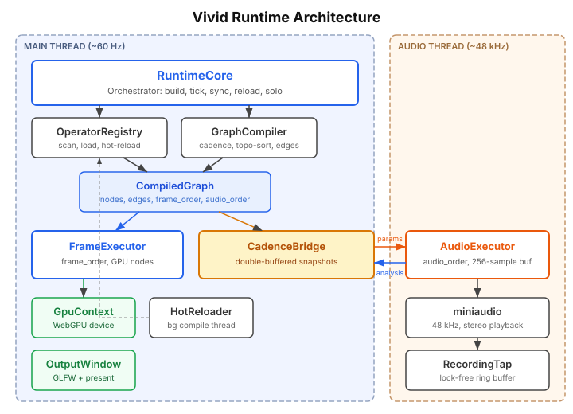
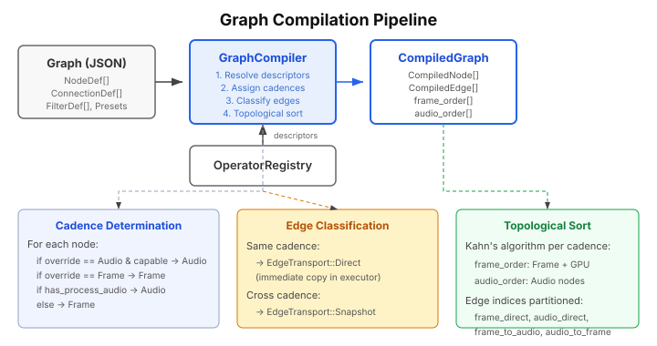

# Vivid Runtime Architecture

*A technical reference for the Vivid audiovisual graph runtime.*

## 1. Introduction

Vivid is a real-time audiovisual graph engine with two execution worlds:

- **Frame** cadence on the main thread for control logic and GPU rendering.
- **Audio** cadence on the audio thread for sample-accurate DSP.

Each operator runs in exactly one of those worlds. Cross-cadence data transfer is explicit and always flows through the `AudioFrameBridge` via bridge edges compiled from the graph.

The runtime's core responsibilities are:

- **Compile** a user-authored graph into a pre-allocated execution plan.
- **Execute** frame-rate and audio-rate operators in topological order on their respective threads.
- **Transfer** data across cadences through explicit bridge semantics.
- **Hot-reload** operator code from rebuilt dynamic libraries without stopping playback.



## 2. Architecture Overview

The runtime is composed of several cooperating subsystems:

| Component | Thread | Role |
|-----------|--------|------|
| **RuntimeCore** | Main | Top-level orchestrator. Owns the compiled graph, audio frame bridge, and frame executor. Drives the tick cycle. |
| **GraphCompiler** | Main (once) | Transforms a `Graph` into a `CompiledGraph`. |
| **CompiledGraph** | Both (read-only) | Pre-allocated node state, classified edges, bridge metadata, and execution orders. |
| **FrameExecutor** | Main | Iterates `frame_order`, propagates direct edges, applies audio-to-frame bridge data, and calls `process_frame()` / `process_gpu()`. |
| **AudioExecutor** | Audio | Iterates `audio_order` inside the miniaudio callback, processes planar sample buffers, and publishes analysis snapshots. |
| **AudioFrameBridge** | Both | Double-buffered snapshot bridge. Transfers explicit frame-to-audio and audio-to-frame bridge payloads without locks. |
| **OperatorRegistry** | Main | Discovers, lazy-loads, and hot-reloads operator dynamic libraries. |
| **GpuContext** | Main | Manages the WebGPU device, queue, and surface. |
| **HotReloader** | Background | Watches source files and runs background cmake builds. |

## 3. The Graph Model

A Vivid graph is a JSON document containing nodes, connections, and metadata.

### NodeDef

Each node declares an operator type and its parameter values:

```json
{
  "osc": {
    "type": "oscillator",
    "params": { "frequency": 440.0, "amplitude": 0.8, "waveform": 0 }
  }
}
```

Key fields: `type` (operator name), `params` (numeric parameter values), `string_params` (file paths, text), and optional `tex_width` / `tex_height` overrides for GPU nodes.

Cadence is not configured per node in graph JSON. It comes from the operator descriptor compiled into the operator binary.

### ConnectionDef

Connections wire an output port of one node to an input port of another:

```json
{ "from": "osc/output", "to": "gain/input" }
```

Cross-cadence connections carry an explicit `bridge` field:

```json
{ "from": "lfo_fr/value", "to": "filter_au/cutoff", "bridge": "hold" }
```

Supported bridge values are compiled into `BridgeKind` and include `hold`, `snapshot`, `last_sample`, `rms`, `peak`, and `waveform`.

Connections may also carry an optional value remap: `from_min`, `from_max`, `to_min`, `to_max`, and `clamp`.

### Port Types

| Type | ID | Description |
|------|----|-------------|
| `SCALAR` | 0 | Scalar numeric value |
| `AUDIO_BUFFER` | 1 | Planar audio sample buffer |
| `LANE_ARRAY` | 2 | Variable-length float array |
| `STRING` | 3 | UTF-8 text |
| `STRING_LANES` | 4 | Variable-length string lane array |
| `TEXTURE` | 5 | `WGPUTextureView` (GPU only) |

Custom port types can be registered at runtime via the port type registry, identified by `stable_type_id`.

## 4. Graph Compilation

The `GraphCompiler` transforms a `Graph` plus an `OperatorRegistry` into a `CompiledGraph` — a fully pre-allocated, ready-to-execute representation.



### Compilation Steps

1. **Resolve descriptors.** For each node, look up the `VividOperatorDescriptor` from the registry. This provides port definitions, parameter metadata, operator kind, and available processing entrypoints.

2. **Assign execution world.** Each node is assigned a fixed cadence directly from its descriptor:
   - operators with GPU processing run on the frame cadence
   - operators with `process_audio()` only run on the audio cadence
   - operators with `process_frame()` only run on the frame cadence

3. **Classify edges.** Each connection becomes a `CompiledEdge`:
   - **Direct** when both endpoints share the same cadence
   - **Snapshot** when endpoints are on different cadences and the graph declares a valid bridge kind

4. **Validate bridge semantics.** Cross-cadence edges must declare a valid `bridge`, and same-cadence edges must not. Bridge compatibility is checked against source/destination port types during compilation.

5. **Topological sort.** Kahn's algorithm produces two execution orders:
   - `frame_order` for frame and GPU nodes
   - `audio_order` for audio nodes

6. **Pre-allocate state.** Buffers, parameter arrays, lane storage, string storage, custom-port staging, GPU textures, and audio buffers are allocated up front. Execution avoids heap allocation on the hot path.

### CompiledGraph Structure

```text
CompiledGraph
├── nodes[]                 — CompiledNode instances (all state)
├── edges[]                 — CompiledEdge instances
├── frame_order[]           — topological indices for frame nodes
├── audio_order[]           — topological indices for audio nodes
├── frame_direct_edges[]    — same-cadence frame edge indices
├── audio_direct_edges[]    — same-cadence audio edge indices
├── frame_to_audio_edges[]  — cross-cadence bridge edge indices
└── audio_to_frame_edges[]  — cross-cadence bridge edge indices
```

## 5. Execution Model

The frame and audio cadences run on independent threads and never block each other.


### Frame Cadence (~60 Hz, Main Thread)

Each frame follows a three-phase pattern:

1. **pre_tick_audio_sync()** — pull the latest `AnalysisSnapshot` from the audio thread and inject bridge results into frame-rate nodes.
2. **FrameExecutor::tick()** — iterate `frame_order`, propagate direct frame edges, call `process_frame()` or `process_gpu()`, and apply skip logic where valid.
3. **post_tick_audio_sync()** — publish frame-side bridge payloads into the `ParamSnapshot` for the audio thread.

### Audio Cadence (~48 kHz, Audio Thread)

The miniaudio callback fires repeatedly with fixed-size sample buffers:

1. Read the active `ParamSnapshot` from `AudioFrameBridge`.
2. Iterate `audio_order`, propagate direct audio edges, and call `process_audio()` with a `VividAudioContext`.
3. Compute analysis payloads such as RMS, peak, waveform summaries, scalar bridge outputs, and lane snapshots.
4. Publish the next `AnalysisSnapshot` back to the frame thread.

## 6. AudioFrameBridge

`AudioFrameBridge` is the sole communication channel between the frame and audio threads. It uses double-buffered snapshots with atomic index swaps; the audio thread never waits on a mutex.


### Frame → Audio: ParamSnapshot

Contains the payloads needed by audio-cadence nodes:

| Field | Content |
|-------|---------|
| `node_params` | Parameter values per audio node |
| `scalar_inputs` | Held scalar bridge values (`hold`) |
| `lane_inputs` | Lane-array snapshots (`snapshot`) |
| `input_string_values` | String and string-lane snapshots |
| `custom_inputs` | Custom-value or custom-ref snapshots |
| `solo_active_set` | Which nodes are active under solo mode |

### Audio → Frame: AnalysisSnapshot

Contains the payloads needed by frame-cadence nodes:

| Field | Content |
|-------|---------|
| `rms`, `peak` | Per-node meter values |
| `waveform` | 1024-sample waveform summaries |
| `scalar_outputs` | Audio-to-frame scalar bridge payloads |
| `lane_outputs` | Lane snapshots from audio nodes |
| `errored`, `error_msgs` | Error state propagated without heap allocation |

Bridge behavior is explicit and edge-driven:

- `hold` keeps the latest frame scalar available to audio inputs
- `snapshot` copies lane, string, or custom payloads across the cadence boundary
- `last_sample`, `rms`, and `peak` reduce audio output to a frame-visible scalar
- `waveform` publishes a summarized lane array for frame-side consumers

## 7. Frame Executor

`FrameExecutor` processes frame-rate and GPU nodes on the main thread.

### Tick Algorithm

```text
for node in frame_order:
    if solo_active and node not in solo_set: skip

    zero input_values

    for edge in frame_direct_edges targeting this node:
        copy output → input (with remap if configured)
        propagate lanes, strings, textures, and custom ports

    apply audio→frame bridge values for dirty bridge inputs

    build VividFrameContext
    call process_frame(instance, ctx)

    if GPU node:
        call process_gpu(instance, gpu_ctx)
```

Bridge-applied values are kept separate from ordinary per-frame input clearing so audio-derived values survive until consumed.

## 8. Audio Executor

`AudioExecutor` runs on the dedicated audio thread and processes planar sample buffers.

### Audio Callback Flow

```text
audio_callback(output_buffer, frame_count):
    snap = bridge.active_params()

    apply snapshot params and bridge inputs to audio nodes

    for node in audio_order:
        if solo_active and not in solo_set: mute

        propagate audio_direct_edges

        if auto_dup_group:
            deinterleave → per-channel mono buffers
            process each channel instance independently
            interleave → multi-channel output
        else:
            process_audio(instance, ctx)

    compute RMS / peak / waveform / scalar bridge payloads
    bridge.publish_analysis()
```

Audio operators receive a `VividAudioContext` with:

| Field | Meaning |
|-------|---------|
| `sample_rate` | Device sample rate |
| `buffer_size` | Samples per callback |
| `input_buffers` | Planar input buffers indexed by input port order |
| `output_buffers` | Planar output buffers indexed by output port order |
| `param_values` | Numeric parameter values |
| `custom_inputs`, `custom_outputs` | Audio-cadence custom port data |
| `delta_time` | Buffer duration in seconds |

There is no separate float-CV side channel in the audio context. Scalar cross-cadence data reaches audio operators only through explicit bridge semantics.

## 9. Compiled Node State

Each `CompiledNode` stores the execution-world-independent state needed by the runtime:

| Category | Examples |
|----------|----------|
| Identity | `node_id`, `type_name`, `operator_kind`, `active_cadence` |
| Scalar state | `param_values`, `input_values`, `output_values` |
| Bridge state | `bridge_input_values`, `bridge_input_dirty`, `input_connected` |
| String state | `input_string_values`, `output_string_values` |
| Lane state | `input_lanes`, `output_lanes`, lane metadata |
| Custom ports | resolved input/output storage |
| Cadence-specific state | `audio` or `gpu` sub-structs |

`AudioNodeState` contains only audio-specific execution buffers, channel metadata, lane execution strategy, and analysis/custom-port bookkeeping. `GpuNodeState` contains textures, pipeline state, and GPU analysis state.

## 10. Operator Contract

Operators are fixed-cadence at runtime:

- frame wrappers implement `FrameProcessable`
- audio wrappers implement `AudioProcessable`
- GPU operators implement `GpuProcessable`

Paired operators expose separate public names such as `<name>_fr` and `<name>_au`. The graph compiler does not infer or promote cadence.

## 11. Hot Reload and Safety

Hot reload keeps the runtime interactive during operator development:

- source changes trigger a background rebuild
- rebuilt operator libraries are reloaded by `OperatorRegistry`
- `RuntimeCore` rebuilds compiled state as needed
- ABI version checks reject stale binaries built against old headers

The runtime favors deterministic hot-path behavior:

- no heap allocation on the audio thread
- lock-free bridge swaps between execution worlds
- explicit bridge semantics instead of implicit cross-cadence coercion
- pre-allocated compiled state for frame, audio, and GPU execution
