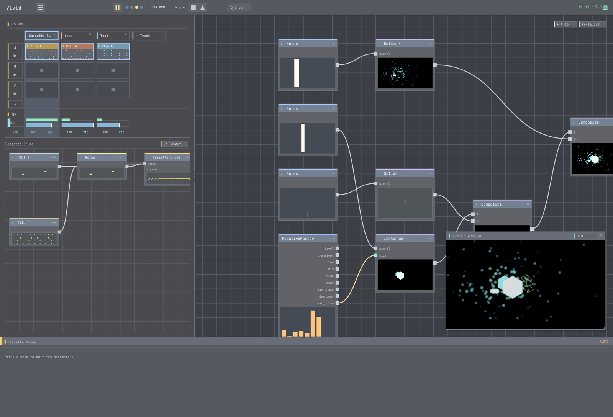

# 01 · Meet Vivid

**Goal:** understand what Vivid *is* and find your way around the interface.
**Time:** ~10 min · **Prerequisites:** Vivid installed and open. No plugins needed for this one.

Vivid is a **live audiovisual instrument**. It has two halves that play together:

- a **DAW** on one side — tracks × scenes of clips, each track an instrument with an effects chain;
- a **visual node-graph** on the other — operators wired together into a picture;

joined by a **bridge** that lets the audio drive the visuals (and, if you want, the visuals drive the
audio back). You *make music and the picture reacts to it*, in real time, and you can rewire either
side while it plays.

Rather than build something yet, you'll open a finished piece and take the tour.



## Steps

### 1. Open a finished project

`File > Open Example`, choose **`pulse`**, and let it load.

> `pulse` is a techno sketch — a good first tour because it uses both surfaces at once.

**✓ You should see:** a session grid of tracks and clips on one side, and a node-graph on the other.

### 2. Press play

Hit the **space bar** (or the transport play button).

**✓ You should hear:** a four-on-the-floor beat. **✓ You should see:** the picture moving *in time*
with it — that coupling is the whole point of Vivid.

### 3. Look at the DAW side (the music)

Find the **session grid**: columns are **scenes** (sections of the song), rows are **tracks** (each an
instrument + effects). The lit cell is the playing clip; the little meters show each track's level.

Click a different **scene** to launch it.

**✓ You should hear:** the arrangement change. This is how you *perform* — by launching scenes live.

### 4. Look at the visuals side (the picture)

Find the **node-graph**. Each box is an **operator**; wires carry an image from one operator's output
into the next, ending at the **Output** node (what you see on screen). Click a node to select it; its
**parameters** appear in the inspector.

Drag a parameter slider.

**✓ You should see:** the picture change live — no stop, no recompile.

### 5. Find the bridge (why it reacts)

Open the **mappings** view (or run `get_mappings` — see the MCP aside). Each mapping wires an **audio
characteristic** (like `master.low` — the kick energy — or a note event) to a **visual parameter**.
That list is *why* the picture moves with the music.

**✓ You should see:** one or more `audio → visual` mappings driving `pulse`'s look.

### 6. Two panels worth knowing

- `View > Audio Output` — pick your speakers/interface if you hear nothing.
- `View > Diagnostics` — a health panel. A **green** dot means all good; it flags a broken operator or
  audio problem instead of failing silently.

**✓ You should see:** a green health dot while `pulse` plays.

## Try it with MCP

Everything above is also driveable over Vivid's control server — this is how an agent (or you, later)
automates it. With the app running:

```bash
# what's loaded, and is it playing?
curl -s -X POST 127.0.0.1:9876/status -d '{}'
# the audio→visual mappings you found in step 5:
curl -s -X POST 127.0.0.1:9876/get_mappings -d '{}'
# the live operator catalog (what you can add to the graph):
curl -s -X POST 127.0.0.1:9876/list_operators -d '{}'
```

Or, from an MCP client, call the `status`, `get_mappings`, and `list_operators` tools. You'll use these
in earnest from tutorial 04 onward.

## Recap

- Vivid = a **DAW** + a **visual node-graph**, joined by a **bridge** (audio characteristics → visual params).
- **Scenes** are song sections you launch live; **tracks** are instruments + FX.
- The **node-graph** ends at **Output**; editing params/wires updates the picture live.
- **Mappings** are what make the visuals react to the music.
- `View > Audio Output` and `View > Diagnostics` are your first stops when something's off.

## Next

→ **[02 · Your first sound](../02-first-sound/)** — start an empty project and make a track play.
