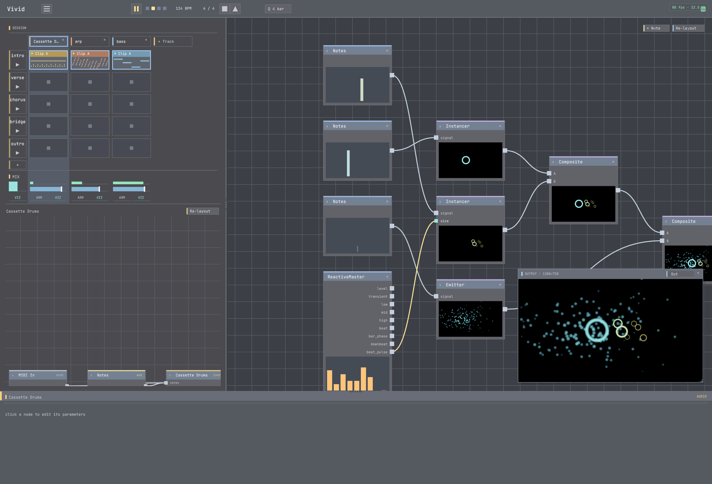

# 02 · Your first sound

**Goal:** start an empty project and make a track play a musical phrase.
**Time:** ~10 min · **Prerequisites:** Surge XT installed (free — see
[`../free-plugin-starter-list.md`](../free-plugin-starter-list.md)).

You'll add a **track**, give it an **instrument**, write a short **clip**, and hit play. These are the
DAW-side building blocks; tutorial 03 does the visual side, and 04 connects them.



## Steps

### 1. New project + set the tempo

`File > New`. Set the tempo (the BPM control near the transport) to **120**.

**✓ You should see:** an empty session — no tracks yet.

### 2. Add an instrument track

Add a track (the **+** / "Add track" affordance on the session view) and load **Surge XT** as its
instrument. Pick a bright preset — a pluck or a lead.

**✓ You should see:** a new track row with Surge XT loaded; **✓** its editor opens if you double-click it.

### 3. Write a clip

Click an empty clip cell on your track to create a clip, then open the **clip editor**. Either:

- **Draw it:** click to add a few notes across a bar, or
- **Cheat with theory:** use the chord/progression helper to drop `Am – F – C – G` (one chord per bar).

Set the clip length to **4 bars**.

**✓ You should see:** notes in the clip editor spanning four bars.

### 4. Play it

Launch the clip (click its play triangle) and press **space** to start the transport.

**✓ You should hear:** your phrase looping. **✓ You should see:** the track meter moving.

### 5. Shape the sound

Open the Surge editor and turn the filter cutoff, or edit the track's FX chain. Small moves — this is
where a preset becomes *yours*.

**✓ You should hear:** the timbre change live while it plays.

## Try it with MCP

The same phrase, built over the control server / MCP tools:

```
set_bpm(120)
add_track(instrument="Surge XT")              # -> track index, e.g. 0
list_presets(track=0, filter="pluck")         # find a preset to load
set_progression(track=0, scene=0, chords=["Am","F","C","G"], beats_per_chord=4)
launch_clip(track=0, scene=0)
```

`set_clip`/`add_notes`/`add_chord` give finer control; `p` accepts note names (`"C4"`) or MIDI ints.

## Recap

- A **track** hosts an **instrument** (+ an FX chain). A **clip** is the notes it plays in a scene.
- The **clip editor** draws notes; the chord/progression helpers are a fast musical shortcut.
- **Launch** a clip + **transport play** to hear it; edit the instrument live.

## Next

→ **[03 · Your first visual](../03-first-visual/)** — make a picture in the node-graph.
