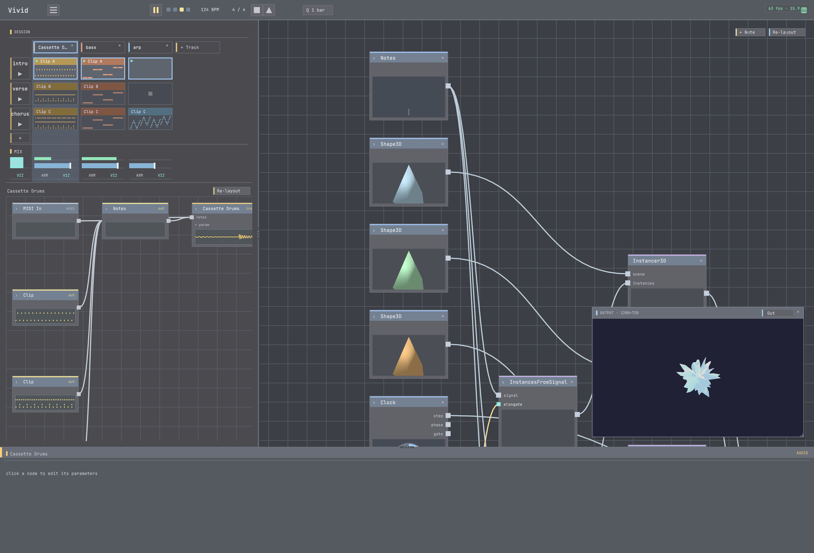

# 03 · Your first visual

**Goal:** build a picture in the node-graph — a generator, wired to Output, that you can shape.
**Time:** ~10 min · **Prerequisites:** tutorial 02 (or any open project). No sound needed yet.

The visuals side is a **graph of operators**. Every chain ends at the **Output** node — that's what
shows on screen. You'll add a source, wire it up, tweak it, then stack an effect on top.



## Steps

### 1. Look at the graph

Find the node-graph. There is always an **Output** node. A fresh project may already have a small
default chain feeding it, or nothing.

**✓ You should see:** the Output node, and whatever currently feeds it.

### 2. Add a generator

Add a node (press **Tab**, or use the add-node menu) and pick a **generator** — try **`CosinePalette`**
(flowing colour bands) or **`NoiseField`**. Generators make an image from scratch (they have no image
input).

**✓ You should see:** a new operator node in the graph.

### 3. Wire it to Output

Drag a wire from the generator's **output** port into the **Output** node's **input** — or select the
generator and set it as the active output.

**✓ You should see:** the generator's image fill the viewer.

> If you see black, check `View > Diagnostics`: a red node badge or `errored_ops` means the operator
> failed to build (rather than failing silently). Fix or replace it.

### 4. Shape it

Select the generator; its **parameters** appear in the inspector. Drag the colour / scale / speed
sliders.

**✓ You should see:** the picture respond live — no recompile.

### 5. Stack an effect

Add a **transform** operator — **`Feedback`**, **`Kaleidoscope`**, or **`Bloom`** — and wire it
*between* your generator and Output (generator → effect → Output). Tweak its params.

**✓ You should see:** the effect applied on top of your generator. You've built a two-node chain.

## Try it with MCP

```
list_operators()                              # the live catalog + each op's params (by intent)
n = add_node("CosinePalette")                 # -> node id
connect_nodes(node_id=<Output id>, input_id=n)   # feed it to Output
set_node_param(node_id=n, name="phase", value=0.3)
k = add_node("Kaleidoscope")
connect_nodes(node_id=<Output id>, input_id=k)   # Output <- Kaleidoscope
connect_nodes(node_id=k, input_id=n)             # Kaleidoscope <- CosinePalette
```

`get_graph` shows node ids + ports; `find_operators("glow")` searches the catalog by intent — and if
nothing fits, it points you at authoring your own (tutorial 06).

## Recap

- The visual graph is **operators wired to Output**. **Generators** make images; **transforms** modify them.
- Add nodes, **wire** output→input, and **select → tweak params** live.
- A black frame is a signal — check **Diagnostics** for a failed operator.

## Next

→ **[04 · Make it react](../04-make-it-react/)** — connect the music to the picture.
