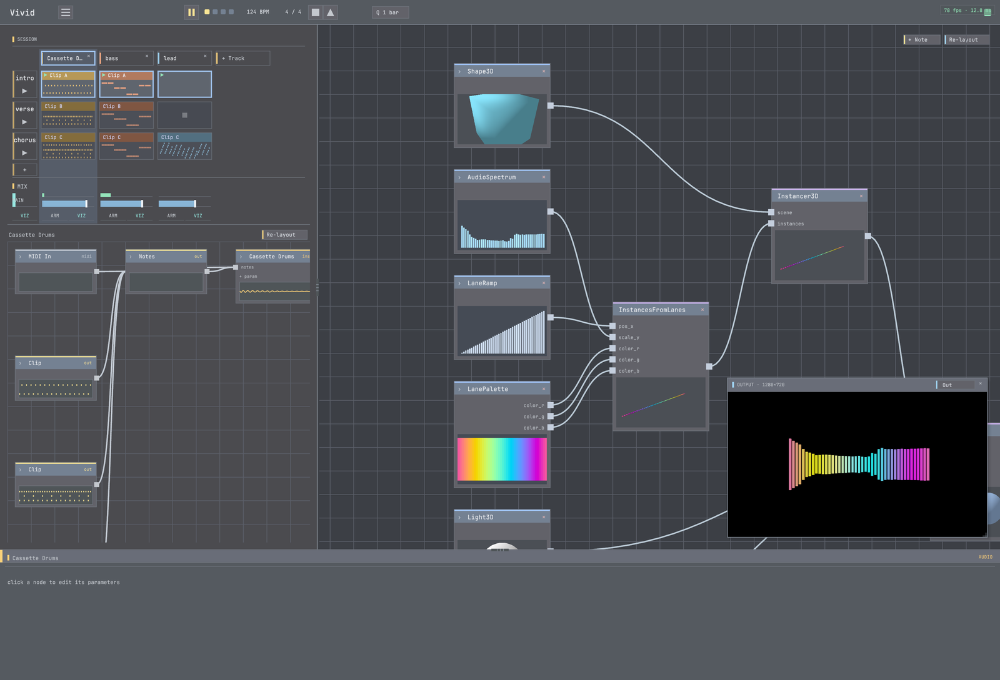

# 04 · Make it react

**Goal:** wire the music to the picture — the **bridge** — so the visuals move with the audio.
**Time:** ~10 min · **Prerequisites:** a project with **sound** (02) **and** a **visual** (03) — or
open the `mirror` example, which is built around the bridge.

This is the payoff. A **mapping** connects an **audio characteristic** to a **visual parameter**. When
the audio moves, the parameter moves, and the picture reacts.



## Steps

### 1. Pick a source and a target

- **Source** (audio): the kick energy is `master.low`; overall loudness is `master.level`; a note-on
  from a track is `track_<id>.gate`.
- **Target** (visual): a parameter on one of your nodes — brightness, scale, a shader `warp`, etc.

**✓ You should have:** one audio source and one visual param in mind.

### 2. Create the mapping

Open the **mappings** view and add one: **`master.low` → your visual param**. (Or use `connect_mapping`
— see the MCP aside.)

**✓ You should see:** the mapping appear in the list.

### 3. Play and watch

Start the transport.

**✓ You should see:** the parameter — and the picture — **pulse with the kick**. That coupling is Vivid.

### 4. Tune it

A raw mapping can be jittery or weak. Adjust:

- **amount** — how far the param moves (`excursion / param_range`);
- **attack / release** — a fast attack + slow release makes each hit *snap then glide* instead of buzzing.

**✓ You should see:** the reaction go from twitchy/subtle to a clean, legible pulse.

### 5. Try a punchier source

Swap the source to a **note gate** — `track_<id>.gate` — which fires a sharp 0→1 on each note. Map it
to something big (a flash, a scale pop).

**✓ You should see:** the visual snap on each note, not just breathe with the energy.

### 6. (Optional) the bridge runs both ways

A visual value can drive an **audio** parameter too (source `viz.<param>`). Map a visual back into a
filter cutoff and the picture starts shaping the sound. Open the `mirror` example to see this in action.

## Try it with MCP

```
connect_mapping(src="master.low", dst="node:<id>.<param>", amount=0.8, attack=0.005, release=0.16)
get_mappings()                      # lists your mapping (incl. the ADR-0053 control edges)
evaluate_visual_reactivity(intent="the kick should pulse the whole picture")   # a taste check
```

`find_params("brightness")` finds mappable targets by intent; `evaluate_visual_reactivity` scores
whether the reaction reads as reactive + legible.

## Recap

- A **mapping** = audio characteristic → visual parameter. It's *why* the visuals react.
- Sources: `master.low/level/high/transient`, or a track's `gate`/`note`/`velocity`.
- **amount** sets size; **attack/release** shape each hit. Note **gates** are the punchiest sources.
- The bridge is **bidirectional** — visuals can drive audio too (`viz.*`).

## Next

→ **[05 · Perform it](../05-perform-it/)** — build sections and launch them live.
