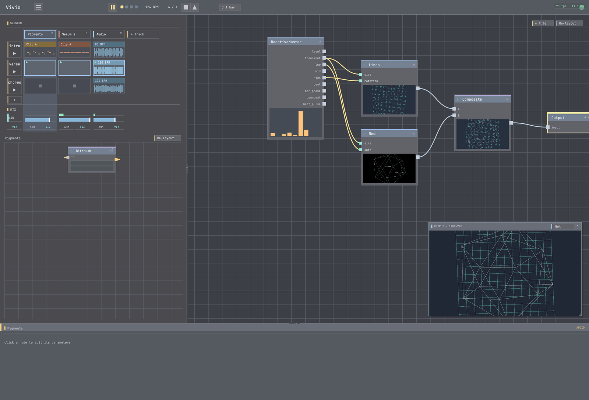

# 05 · Perform it

**Goal:** turn a loop into an arrangement — **scenes** as sections you launch live.
**Time:** ~10 min · **Prerequisites:** a playing project (02–04). Open `fracture` if you want a
five-section example to study.

A **scene** is a column in the session grid — a snapshot of which clip each track plays. Different
scenes = different sections of your piece. You **perform** by launching scenes while it runs.



## Steps

### 1. See scenes as sections

In the session grid, columns are **scenes**, rows are **tracks**. Your project so far has one scene —
that's a loop, not an arrangement.

**✓ You should see:** a single active scene column.

### 2. Make a second scene

Add a scene, then give it a **variation**: a busier drum clip, a fuller chord voicing, or a different
visual look (swap the active generator, or push a mapping amount up).

**✓ You should see:** two scenes — an "intro" and a "main".

### 3. Add a peak

Add a third scene as a **peak**: densest drums, brightest visuals. You now have intro → main → peak.

**✓ You should see:** three scenes, each visibly/audibly distinct.

### 4. Quantize the launch

Set **launch quantize** to **1 bar** so scene changes snap to the downbeat instead of switching
mid-phrase.

**✓ You should see:** a launched scene wait for the bar line before it takes over.

### 5. Perform

Start playing and **launch scenes in sequence** — intro, then main, then peak — listening/watching the
piece build.

**✓ You should hear + see:** a real arrangement, driven by you, in time.

### 6. (Optional) let the visuals cut themselves

Wire a **`Clock` → `Switch3D`** in the visual graph to cut between looks on the beat automatically — so
the picture has its own rhythm on top of your scene launches. `grid` and `fracture` do this.

## Try it with MCP

```
add_scene()                          # -> new scene index
# author each scene's clips (set_progression/set_clip per track), then perform:
set_launch_quantize(bars=1)
launch_scene(0)   # intro
launch_scene(1)   # main   (takes over on the next bar)
launch_scene(2)   # peak
```

### Keep the take

A performance is only worth as much as what you can play back. Vivid records the **live master
mix** to a lossless `.wav` while you launch scenes:

```
start_master_record("/absolute/path/take.wav")
# ...perform: launch_scene(0), launch_scene(1), launch_scene(2)...
stop_master_record()                 # -> {path, duration_sec, peak, clipped, overruns}
```

Check **`overruns`** on the result: anything above 0 means blocks were dropped and the capture has
gaps, so redo the take.

> Why not `export_audio`? That renders offline from beat 0 with whatever is *currently* armed — it
> cannot replay a timeline of scene launches, so it cannot capture an arrangement you performed by
> hand. That is exactly what this is for.

**✓ You should have:** a `.wav` of the arrangement as you played it, with `overruns: 0`.

## Recap

- **Scenes** are song sections; **launching** them live is how you perform and arrange.
- **Launch quantize** keeps changes on the bar.
- `Clock → Switch3D` gives the visuals their own beat-locked cuts.
- `start_master_record` / `stop_master_record` capture the performance losslessly.

## Next

→ **[06 · Make it yours](../06-author-an-operator/)** — author your own operator.
