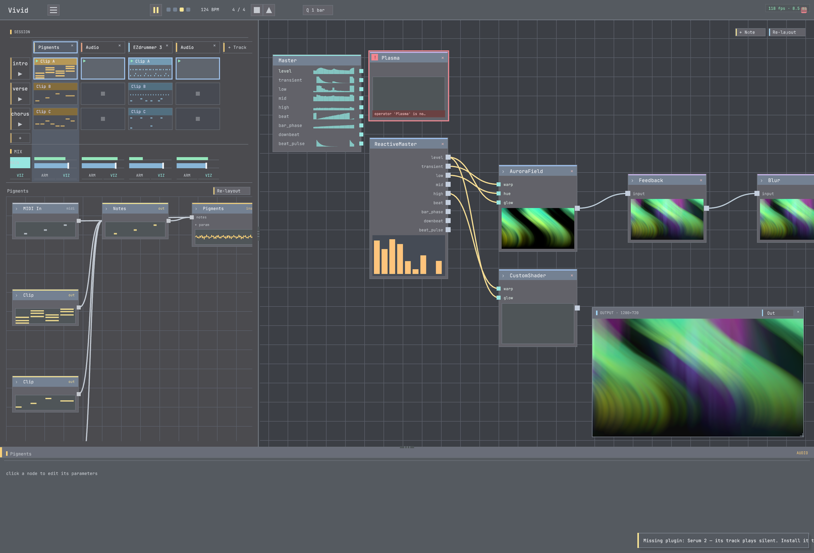

# 06 · Make it yours — author an operator

**Goal:** when no built-in gives you the look you want, **write your own operator**. This is Vivid's
core move, and it's fast.
**Time:** ~15 min · **Prerequisites:** tutorial 03 (the visual graph).

The built-in operators are teaching examples, not the ceiling. The moment you find yourself chaining
five ops to fake one effect — or you search the catalog and nothing fits — **author the operator you
actually want.** The easy path is a **shader**: a fullscreen fragment you edit live.



## Steps

### 1. Decide to author

Search the catalog for the look you want (`find_operators`, or browse). If nothing matches your intent,
that's your cue — not a dead end. (The catalog even tells you so.)

**✓ You should have:** a look in mind that no built-in provides.

### 2. Add a CustomShader + a project shader file

Add a **`CustomShader`** node and point its **file** parameter at a new `.glsl` in your project folder
(e.g. `my_look.glsl`). Wire the node to **Output**.

**✓ You should see:** the CustomShader rendering (a default look until you edit the file).

### 3. Edit the shader — live

Open `my_look.glsl` in your editor and write a simple fullscreen fragment: colour from `uv` and `time`
(so it moves). Save.

**✓ You should see:** the picture **hot-reload** the instant you save — no restart.

### 4. Break it on purpose, then fix it

Introduce a typo and save.

**✓ You should see:** an **error surfaced** (a toast + the node flags it) while the **last good version
keeps rendering** — Vivid doesn't fail silently. Fix the typo, save → it recovers. (If a shader ever
renders pure black, check `View > Diagnostics` / `get_health` — a build failure shows there.)

### 5. Add a knob, then make it react

Add a **uniform parameter** to your shader (a `warp` or `brightness`), so it appears as a node param.
Then, per **tutorial 04**, map an audio source to it — `master.low → node:<id>.warp`.

**✓ You should see:** your own operator reacting to the music.

### 6. Graduate: a real C++/GPU operator

Shaders cover fullscreen looks. For **geometry, multi-pass, 3D, or particles**, author a full
**C++/GPU operator** — `scaffold_operator_package` writes a known-good starter you edit, build, and
reload live. Your op then appears in `list_operators` like any built-in and **ships inside the project**
(it compiles on `load_project`). See the [`project-cpp-operator`](../project-cpp-operator/) follow-up.

## Try it with MCP

```
get_operator_authoring_guide()                # when-to-author, the two op kinds, the loop, the gotchas
scaffold_project_shader_operator(name="MyLook")   # a shader-op starter in the project
reload_operator_package()                     # register/refresh it live -> appears in list_operators
get_health()                                  # errored_ops>0 means a build failed (not a silent black)
```

For a C++/GPU op: `scaffold_operator_package(name="MyOp")` → edit → `build_operator_package` →
`reload_operator_package`.

## Recap

- Authoring is the **encouraged default** when a built-in doesn't fit — not a last resort.
- **Shaders** (CustomShader / `scaffold_project_shader_operator`) are the fast path; edits **hot-reload**.
- Build/shader failures **surface** (toast, node badge, `get_health.errored_ops`) — never silent black.
- Add **params** to make your op tweakable + mappable. **C++/GPU** ops cover everything beyond fullscreen.
- Custom ops **ship with the project** (compile on `load_project`).

## Next

→ **[07 · Save & share](../07-save-and-share/)** — package it up and export a video.
