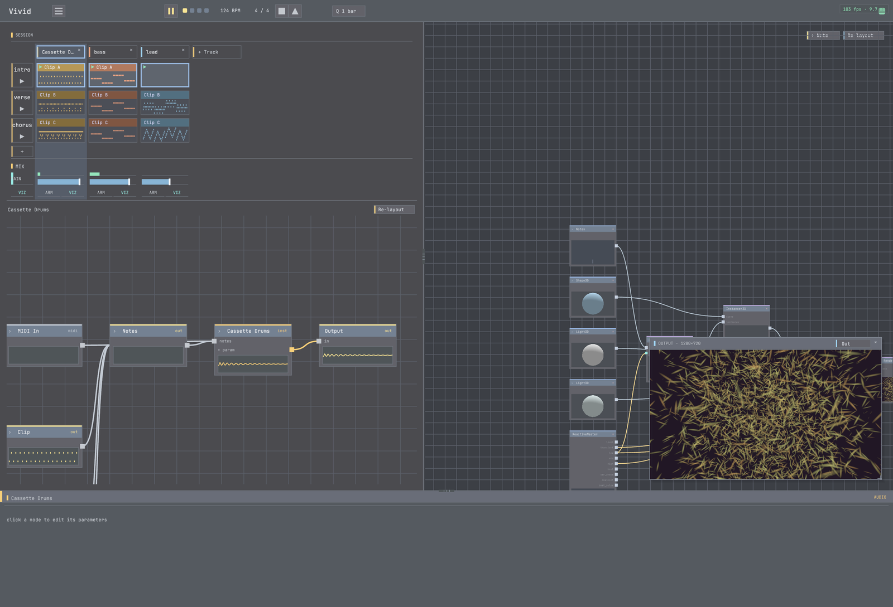

# 07 · Save & share

**Goal:** save your piece as a portable project and export a video to share.
**Time:** ~10 min · **Prerequisites:** a finished piece (02–06).

A Vivid project is a **self-contained folder** — the session, the visual graph, your mappings, and any
custom shaders/operators and media. That means it opens on another machine, and it's what the demos and
showcases ship as.



## Steps

### 1. Save the project

`File > Save`, choose a folder.

**✓ You should see:** a project folder containing `project.json` (+ a `vivid-package.json` and your
`.glsl`/`.cpp` if you authored operators, + any imported media).

### 2. Prove it round-trips

Quit, relaunch, `File > Open` your folder.

**✓ You should hear + see:** the piece come back **identical** — drums audible, mappings intact, custom
operators recompiled on load. (If drums come back silent, that's a bug — it shouldn't happen.)

### 3. Export the audio

`File > Export Audio…`, set a length, export.

**✓ You should get:** a valid `.wav`. A too-hot mix warns that it **clipped** — pull the master down and
re-export.

### 4. Export a video (realtime)

`File > Export Video…` — captures what plays, in real time, to an `.mp4` with synced audio.

**✓ You should get:** an `.mp4` that opens in QuickTime, audio and picture in sync.

### 5. Export a video (deterministic)

`File > Export Video (Deterministic)…` renders **offline** to an `.mp4` — the visuals react to the
bounced audio with sample-accurate timing, so the result is **reproducible** (great for a final render).

**✓ You should get:** a clean `.mp4`; the same project exports the same frames every time.

### 6. Share

Zip the project folder and hand it off — it's self-contained. Or share the exported video.

## Try it with MCP

```
save_project(path="/path/to/my-piece")
export_audio(path="/path/to/mix.wav", seconds=30)
export_av(path="/path/to/render.mp4", seconds=30, fps=60)   # deterministic offline render
```

## Recap

- A project is a **portable, self-contained folder** — session + graph + mappings + custom ops + media.
- It **round-trips** across launches and machines (custom ops recompile on open).
- Three exports: **WAV** (audio), **realtime video**, and **deterministic video** (reproducible).

## You've finished the learning path 🎉

You can now build a piece end-to-end, make it react, perform it, author your own operators, and ship it.

Go deeper:
- [`mcp-native-first-project`](../mcp-native-first-project/) — build a whole project agent-driven.
- [`live-shader-edit`](../live-shader-edit/) — the shader-editing workflow in depth.
- [`project-cpp-operator`](../project-cpp-operator/) — author a C++/GPU operator.
- Operator reference: <https://vivid.seethroughlab.com/reference/>.
